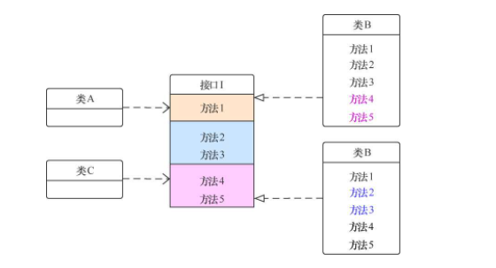
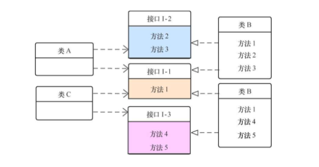

整洁的代码，让错误无处隐藏。破窗效应，KISS原则，梳理一些代码精进的原则

<!-- more -->

# 代码精进之路

自述: 整洁代码是十分有必要的,在平时的编程工作中,基本上更多的时间是花在阅读别人的代码上面,写出优雅整洁的代码这正是我们所需要的.

**一切的原则：容易理解的代码**

1：Bjarne Stroustrup ,C++发明者:我喜欢优雅和高效的代码。代码逻辑应当直截了当，叫缺陷难以隐藏；尽量减少依赖关系，使之便于维护；依据某种分层战略完善错误处理代码；性能调至最优，省得引诱别人做没规矩的优化，搞出一堆混乱来。整洁的代码只做好一件事。

2：Ron c#（c#极限编程探索）作者简单的代码，依其重要顺序：能通过所有测试；没有重复的代码；体现系统中的全部设计理念；包含尽量少的实体，比如类，方法，函数等。

以下大多数资料来源于书籍**代码整洁之道**,[链接](https://book.douban.com/subject/4199741/)

**1.关于命名**

1：有意义的命名，避免前缀,添加有意义的语境

2：如果你无法想出一个合适的名字，很可能意味着代码“坏味道”（功能太多，内聚性不够，理解不够透彻）

3：变量是名词（正确描述业务），方法是动词（有表现力不空泛）类名应该是名词或名词短语

```
int d；//消逝的时间，以日计
private void processData(){}
public class Customer{}
```

4:有意义的区分

```
getActiveAccount()；
getActiveAccounts()；
getActiveAccountInfo()；
```

5:使用读的出来的命名缩写有时候没有意义，看得懂的命名比模糊的命名更有表现力,长而具有描述性的名称，要比短而令人费解的名称好

5.1:代码的写法应该使理解代码的人所需要的时间最小化。

5.2:时间:9读1写

5.3:一般来说代码是越少越好,但不都是这样有时候,一行代码不容易理解可是适当拆分增加可读性把信息装到名字里

**给名字附加额外信息**

| 场景                                   | 变量名   | 更好的名字        |
| -------------------------------------- | -------- | ----------------- |
| 一个纯文本的密码，需要加密后才可以使用 | password | plaintextPassword |
| 一条用户评论，需要转义后显示           | comment  | unescapedComment  |
| 已转化为UTF-8的HTML文本                | html     | htmlUtf8          |
| 以"URL"方式编码的输入数据              | data     | dataURLEncode     |

**带单位的命名**

| 参数或变量                    | 带单位的命名       |
| ----------------------------- | ------------------ |
| start(int delay)              | delay -> delaySecs |
| createCache(int size)         | size -> sizeMB     |
| throttleDownload(float limit) | limit -> maxKB     |
| setHeight(float height)       | height -> heightCM |

**有表现力的词**

| 单词  | 更多选择                                           |
| ----- | -------------------------------------------------- |
| send  | deliver、dispatch、announce、distribute、route     |
| find  | search、extract、locate、recover                   |
| start | launch、create、begin、open                        |
| make  | create、set up、build、generate、compose、add、new |

1.使用专业的词

2.避免使用空泛的词

3.给变量名带上附加信息

4.为作用域更大的变量起一个长的名字

5.有目的的使用大小写和下划线

6.有表现力的词*清晰的命名和精确的命名比看起来容易懂的命名要更有表现力

[谷歌代码规范](https://github.com/google/styleguide) | [中文](http://zh-google-styleguide.readthedocs.io/en/latest/)[Java 代码规范](https://google.github.io/styleguide/javaguide.html)[C++ 代码规范](https://google.github.io/styleguide/cppguide.html)[Python 代码规范](https://github.com/google/styleguide/blob/gh-pages/pyguide.md)[JavaScript 代码规范](https://google.github.io/styleguide/jsguide.html)

**2.关于函数**

1：应该尽量短小，方法不要超过20行代码

2：只做一件事情（做好这件事，只做这一件事）

3：一个函数中的抽象在同一个水平上，而不是高层抽象和实现细节混杂在一起。SLAP（Single Level of Abstration Principle）

4：函数参数尽量少，参数尽量别反直觉。多余3个可以考虑封装为类

5：减少辅助代码（比如：日志，鉴权，缓存检测 Aop面向切面编程）

6：自顶向下读代码：向下规则（每个函数后面都跟着位于下一抽象层次的函数）

7：函数应该只做一件事，错误处理就是一件事，处理错误的函数应该不做其它事，如果try在某个函数存在，他应该是第一个单词。而且catch/finally不应该包含其它内容

8：别返回null值

9：不建议使用Map在系统中传递

**3.关于注释**

1：注释不能美化代码，有时候注释会撒谎

2：对意图的解释（某个决定后面的意图）

3：不能修改的标准库之类的参数和返回值进行解释

4：警示，提醒程序的某种后果

5：TODO注释（解释为什么该函数的实现部分无所作为，将来应该是怎样）4：用代码来阐述

**4.对象和数据结构**

1：对象：对象把数据隐藏于抽象之后，曝露操作数据的函数

2：数据结构：数据结构曝露其数据，没有提供有意义的函数。最为精练的数据结构：是一个只有公共变量，没有函数的类。（DTO-Data Transfer Objects）

**5.关于类**

1：类应该短小

2：单一权责:类和模块应该只有一条加以修改的理由

**6.设计原则**

Kent Beck 简单设计的四条原则

1：运行所有测试；

2：不可重复

3：表达了程序员的意图

4：尽可能减少类和方法的数量*以上规则按其重要程度排序尽量使类和函数的数量尽量少是很重要，但更重要的却是测试，消除重复和表达力

Single Responsibility Principle（SRP）：单一职责原则。Open Close Principle（OCP）：开闭原则。Liskov Substitution Principle（LSP）：里氏替换原则。Interface Segregation Principle（ISP）：接口隔离原则。Dependency Inversion Principle（DIP）：依赖倒置原则。

SRP（单一职责原则）任何一个软件模块中，应该有且只有一个被修改的原因。职责越单一，被修改的原因就越少，模块的内聚性（Cohesion）就越高,被复用的可能性就越大，也更容易被理解。软件实体应该对扩展开放，对修改关闭。

OCP（开闭原则）软件实体应该对扩展开放，对修改关闭。

LSP（里氏替换原则）程序中的父类型都应该可以正确地被子类型替换。程序中的对象应该是可以在不改变程序正确性的前提下被它的子类所替换的”，即子类应该可以替换任何基类能够出现的地方，并且经过替换后，代码还能正常工作.

ISP（接口隔离原则）

多个特定客户端接口要好于一个宽泛用途的接口。

接口隔离原则认为不能强迫用户去依赖那些他们不使用的接口。换句话说，使用多个专门的接口比使用单一的总接口要好。



未遵循ISP的示例



遵循ISP的示例

DIP（依赖倒置原则）

模块之间交互应该依赖抽象，而非实现。

1:面向接口编程

2:DIP本身的意义要宽泛得多，它是一种思想，是一种软件设计的哲学。

DRY(不要重复)DRY是Don’t Repeat Yourself的缩写，DRY原则特指在程序设计和计算中避免重复代码1:因为这样会降低代码的灵活性和简洁性2:可能导致代码之间的矛盾

YAGNIYAGNI（You Ain’t Gonna Need It）的意思是“你不会需要它”1:YAGNI是针对“大设计”（Big Design）提出来的，是“极限编程”提倡的原则，2:不要过度设计，它背后的指导思想就是尽可能快、尽可能简单地让软件运行起来。

Rule of ThreeRule of Three也被称为“三次原则”，三次原则指导我们可以通过以下步骤来写代码。（1）第一次用到某个功能时，写一个特定的解决方法。（2）第二次又用到的时候，复制上一次的代码。（3）第三次出现的时候，才着手“抽象化”，写出通用的解决方法。1：是对DRY原则和YAGNI原则的折中2：反对过度设计（OverDesign），也绝对不赞成无设计（No Design）

KISS原则事情变复杂很简单，把事情变简单很复杂。好的目标不是越复杂越好，反而是越简洁越好。

POLA原则（最小惊奇原则）POLA（Principle of least astonishment）是最小惊奇原则要的是简单易懂，而不是时不时冒出个“Surprise”。

你可以，不代表你应该。（Just because you can, doesn’t mean you should.）——施莉琳·凯尼恩

**7.味道与启发**

注释：

1：不恰当的信息

2：废弃的注释

3：冗余的注释

4：糟糕的注释

5：注释掉的代码

环境：

1：需要多久才能实现的构建

2：需要多久才能做到的测试

函数

1：过多的参数

2：输出参数违反直觉

3：标识参数（布尔值参数）

4：死函数（永不被调用的方法）

一般性问题

1：一个源文件中存在多种语言

2：明显的行为未被实现（最小惊奇原则）

3：不正确的边界行为（别依赖直觉，追索每种边界的条件，并编写测试）

4：忽视安全（遵守安全就不便于做试验，结果就是试验未能运行，忽视安全相当危险）

5：重复（重复代码代表遗漏了抽象）

6：在错误的抽象层级上的代码（低层级的概念（细节有关的常量，变量或工具函数）放在派生类中，所有较高层级概念放在基类中）

7：基类依赖于派生类

8：信息过多

9：死代码

10：垂直分隔变量和函数应该在靠近被使用的地方定义。本地函数应该正好在首次使用的位置上声明，垂直距离要短私有函数应该刚好在其首次被使用的位置下面定义。找个私有函数，应该只是从其首次被使用处往下看一点那么简单

11：前后不一致（最小惊奇原则，小心选择约定一旦选中，就小心持续遵循）

12：混淆视听（不使用的构造函数，变量，函数，没有信息量的注释都应该去掉）

13：人为耦合

14：特性依恋（类的方法只应对其所属类中的变量和函数感兴趣，不该垂青其它类中的变量和函数）

15：选择算子参数（boolean参数）

16：晦涩的意图

17：位置错误的权责

18：不恰当的静态方法

19：使用解释性变量

20：函数名称应该表达其行为

21：理解算法

22：把逻辑依赖改成物理依赖

23：用多态代替if/else或switch/case

24：遵循标准约定

25：用命名常量替代魔术数

...

参考资料:书籍:(代码整洁之道)：[链接](https://book.douban.com/subject/4199741/https://github.com/biezhi/write-readable-code)
