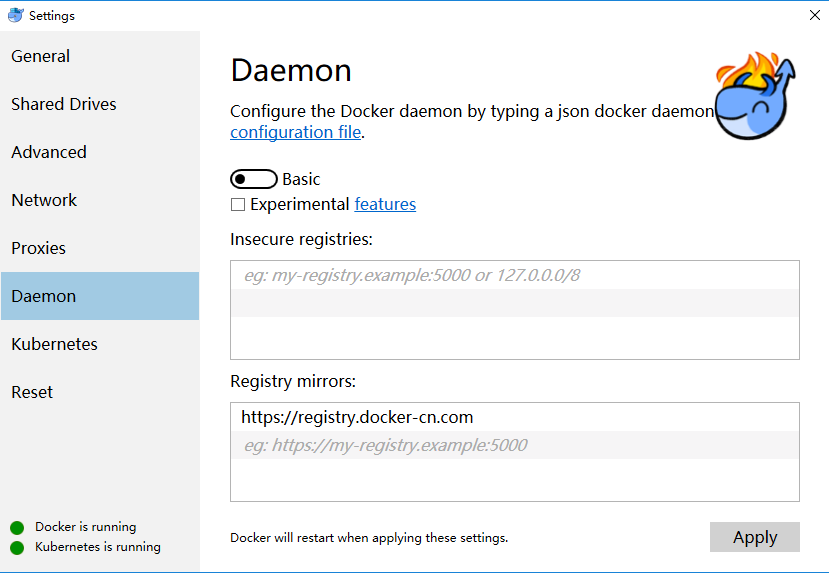
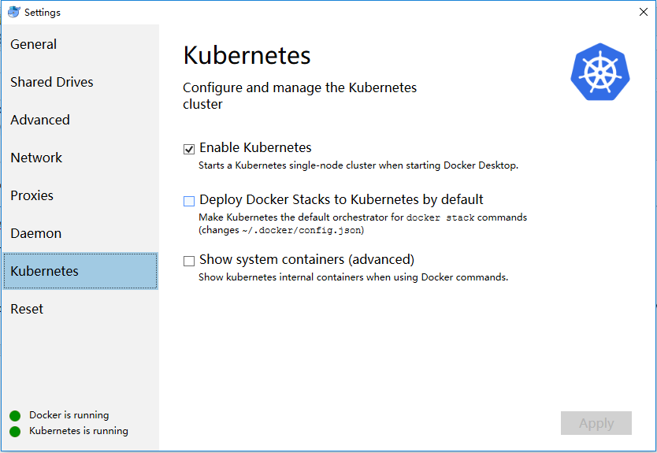
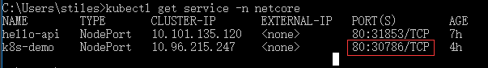
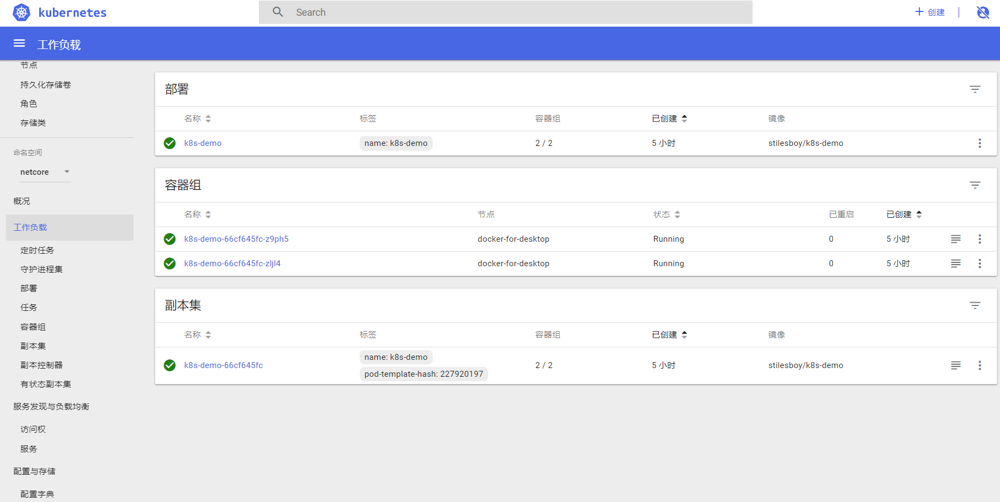

# .NET Core on K8S入门演示

**前言**

[学习了下jessetalk的.NET](http://xn--jessetalk-zb6ng3abn959kfm9e.NET) Core on K8S快速入门课程 有兴趣的同学可以通过http://video.jessetalk.cn报名，我这里简单的做了下笔记

Docker: 是一个开源的应用容器引擎，让开发者可以打包他们的应用以及依赖包到一个可移植的容器中，然后发布到任何流行的 Linux 机器上，也可以实现虚拟化。容器是完全使用沙箱机制，相互之间不会有任何接口。

Kubernetes：Kubernetes是Google开源的容器集群管理系统，实现基于Docker构建容器，利用Kubernetes能很方面管理多台Docker主机中的容器。

kubectl:客户端命令行工具，将接受的命令格式化后发送给kube-apiserver，作为整个系统的操作入口

chocolately:强大的windows 软件包管理工具

**安装docker**从Docker官方站点下载并安装Docker for Mac或Docker for Windows

**设置docker**在 Docker ->Settings-> Daemon 中，配置 registry mirror 为 https://registry.docker-cn.com



加载镜像

运行下列脚本可以从阿里云镜像服务下载Kubernetes安装所需Docker镜像

```
git clone <https://github.com/AliyunContainerService/k8s-for-docker-desktop>
cd k8s-for-docker-desktop
```

windows10环境下进入对应k8s-for-docker-desktop目录选中load_images.ps1右击使用PowerShell运行,即可下载对应镜像

开启Kubernetes

在docker开启 Kubernetes，等待如下消息 Kubernetes is running



**安装 chocolately**

使用管理员权限打开PowerShell执行

```
Set-ExecutionPolicy Bypass -Scope Process -Force;
iex ((New-Object System.Net.WebClient).DownloadString('<https://chocolatey.org/install.ps1>'))
```

**使用Chocolately安装kubectl**

```
choco install kubernetes-cli
kubectl version
```

**验证 Kubernetes 安装**

```
kubectl cluster-info
kubectl get nodes
```

**[创建默认.net](http://xn--5brr72ac28a2bq.net) core web项目**

使用名称为K8s-demo，用于演示使用.

**创建Dockerfile文件**

```
FROM microsoft/dotnet:2.1-aspnetcore-runtime AS base
WORKDIR /app
EXPOSE 80

FROM microsoft/dotnet:2.1-sdk AS build
WORKDIR /src
COPY . .

RUN dotnet restore
RUN dotnet build  -c Release -o /app

FROM build AS publish
RUN dotnet publish -c Release -o /app

FROM base AS final
WORKDIR /app
COPY --from=publish /app .
ENTRYPOINT ["dotnet", "K8s-demo.dll"]
```

**发布到docker**

```
docker build -t stilesboy/k8s-demo .
```

**实例化容器**

```
docker run -d -p 8085:80 --name k8s-demo stilesboy/k8s-demo
```

**[推送到hub.docker.com](http://xn--hub-7j2ep21fi04d.docker.com)**

需要先行注册账号,[在.net](http://xn--3ds.net) core目录下执行

```
docker login --username stilesboy
docker push stilesboy/k8s-demo
```

创建namespace

```
kubectl create namespace netcore
```

**创建deploy.yaml文件**

```
apiVersion: apps/v1
kind: Deployment
metadata:
  name: k8s-demo
  namespace: netcore
  labels:
    name: k8s-demo
spec:
    replicas: 2
    selector:
      matchLabels:
        name: k8s-demo
    template:
        metadata:
          labels:
            name: k8s-demo
        spec:
          containers:
          - name: k8s-demo
            image: stilesboy/k8s-demo
            ports:
            - containerPort: 80
            imagePullPolicy: Always

---

kind: Service
apiVersion: v1
metadata:
  name: k8s-demo
  namespace: netcore
spec:
  type: NodePort
  ports:
   - port: 80
     targetPort: 80
  selector:
      name: k8s-demo
```

**创建K8S service**

```
kubectl create -f deploy.yaml
```

**查看服务**

```
kubectl get service -n netcore
```



本例子查看对应曝露的端口地址为30786

使用浏览器打开http://127.0.0.1:30786/api/values

**安装Dashboard UI**

kubectl create -f https://raw.githubusercontent.com/kubernetes/dashboard/master/aio/deploy/recommended/kubernetes-dashboard.yaml

**开启API Server的本地监听端口**

```
kubectl proxy
```

打开控制台

```
<http://localhost:8001/api/v1/namespaces/kube-system/services/https:kubernetes-dashboard:/proxy/#!/service?namespace=netcore>
```



参考资料：

[Docker社区版中Kubernetes开发](https://developer.aliyun.com/article/508460)[.NET Core on K8S快速入门课程](http://video.jessetalk.cn/)