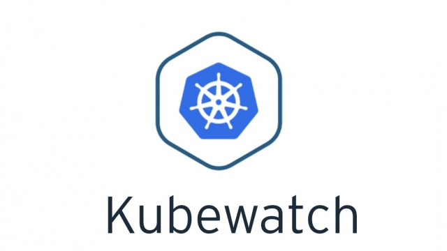
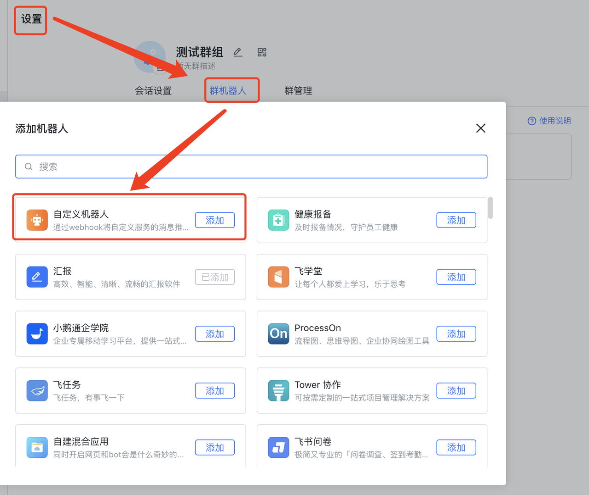
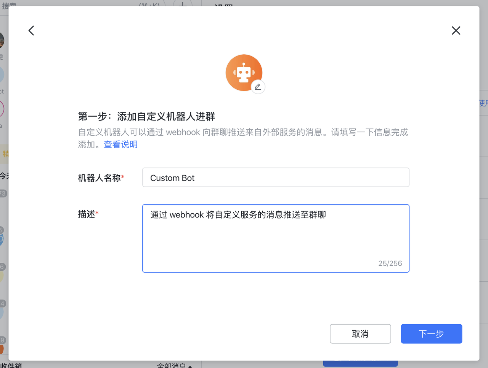
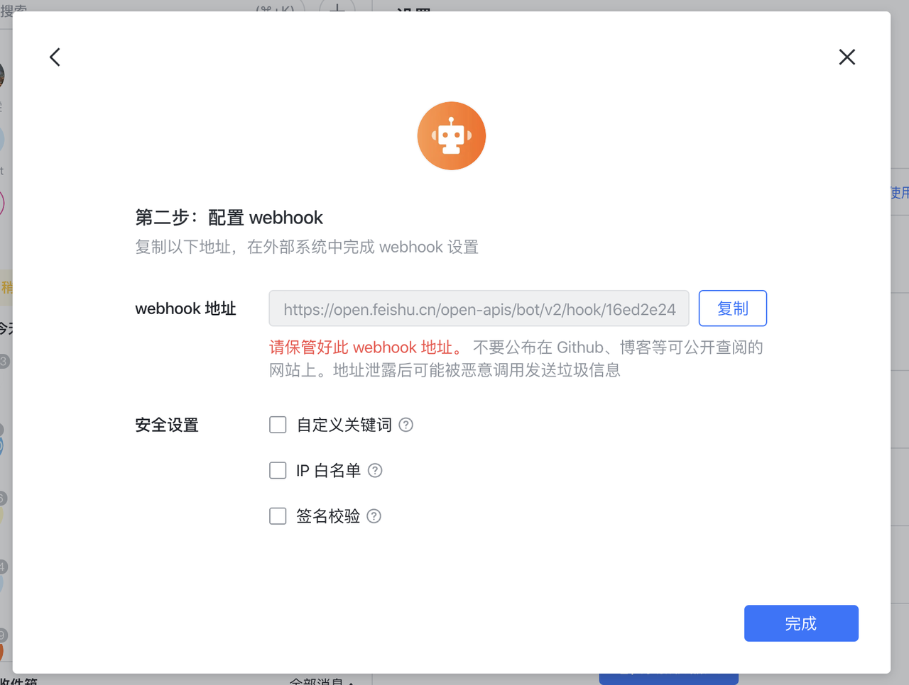
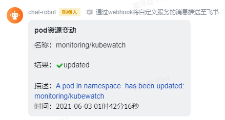

>实践kubewatch监控Kubernetes 资源信息，通过飞书发送告警通知

<!-- more -->

## **kubewatch**

kubewatch是一个用 Go 编写并由 Bitnami Labs 开发的开源 Kubernetes 资源监控观察器。它监视指定的 Kubernetes 资源的更改，再通过handler 将这些变化以通知的形式发布到可用的渠道，例如Slack、Hipchat 等。也可以在应用程序中通过Webhook 的方式来收听kubewatch 发出的状态变化通知。



您可以通过 kubectl 或使用 helm charts 安装 Kubewatch。它易于理解并且具有非常易于使用的界面。除了 slack，它还支持 HipChat、Mattermost、Flock、webhook 和 SMTP。

根据您要监控的 Kubernetes，您可以在 ConfigMap 文件中为这些资源设置 true 或 false。设置 kubewatch 配置并运行 pod 后，您将开始接收有关 Kubernetes 事件的通知.

基于kubectl的安装方式如下,其它方式可参考 github地址：https://github.com/bitnami-labs/kubewatch具体配置如下,添加资源权限创建文件rbac.yaml,内容如下

```
apiVersion: rbac.authorization.k8s.io/v1
kind: ClusterRole
metadata:
  labels:
    kubernetes.io/bootstrapping: rbac-defaults
  name: system:kubewatch
  namespace: monitoring
rules:
  - apiGroups:
      - ""
      - "apps"
    resources:
      - endpoints
      - services
      - pods
      - namespaces
      - replicationcontrollers
      - configmaps
      - replicasets
      - secrets
      - deployments
      - daemonsets
    verbs:
      - list
      - watch
      - get
---
apiVersion: rbac.authorization.k8s.io/v1
kind: ClusterRoleBinding
metadata:
  annotations:
    rbac.authorization.kubernetes.io/autoupdate: "true"
  labels:
    kubernetes.io/bootstrapping: rbac-defaults
  name: system:kubewatch
  namespace: monitoring
roleRef:
  apiGroup: rbac.authorization.k8s.io
  kind: ClusterRole
  name: system:kubewatch
subjects:
  - kind: ServiceAccount
    name: kubewatch
    namespace: monitoring
```

执行以下命令创建资源:

```
kubectl create -f rbac.yaml
```

部署kubewatch, 创建如下文件kubewatch-deploy.yaml

```
apiVersion: v1
kind: ConfigMap
metadata:
  name: kubewatch
  namespace: monitoring
data:
  .kubewatch.yaml: |
    handler:
      webhook:
        url: "<http://xxx.xxx>"
        enable: true
    resource:
      deployment: true
      replicationcontroller: true
      replicaset: false
      daemonset: true
      services: true
      pod: false
      secret: false
      configmap: false
---
apiVersion: apps/v1
kind: Deployment
metadata:
  labels:
    app: kubewatch
  name: kubewatch
  namespace: monitoring
spec:
  replicas: 1
  selector:
    matchLabels:
      app: kubewatch
  template:
    metadata:
      labels:
        app: kubewatch
    spec:
      containers:
        - image: bitnami/kubewatch #using this image, its more stable and active
          imagePullPolicy: Always
          name: kubewatch
          volumeMounts:
            - name: config-volume
              # mountPath: /root
              mountPath: /opt/bitnami/kubewatch/.kubewatch.yaml
              subPath: .kubewatch.yaml
      restartPolicy: Always
      serviceAccount: kubewatch
      serviceAccountName: kubewatch
      volumes:
        - name: config-volume
          configMap:
            name: kubewatch
```

**执行以下命令创建资源:**

```
kubectl create -f kubewatch-deploy.yaml
```

其它安装方式请参考：https://github.com/bitnami-labs/kubewatch

## **基于飞书配置webhook**

地址：

https://www.feishu.cn/hc/zh-CN/articles/360024984973





配置 webhook。你会获取该机器人的 webhook 地址，格式如下：

https://open.feishu.cn/open-apis/bot/v2/hook/xxxxxxxxxxxxxxxxx

复制此地址，在相关外部系统中进行配置，以向本群发送消息。请妥善保存好此地址，避免地址泄露后被恶意调用发送垃圾消息。



- 飞书需要使用post方式，真正对接过程中需要用接口中转下真正的请求。

具体可自行实现。

最后kubernetes资源变更时会收到如下通知,结果如下：



## **webhook对接细节**

kubewatch触发webhook监控后，发送的内容通过body里面的二进制传输，这个比较坑，文档不够齐全，找了半天才发现，具体可查看源码。

body内容解析后格式如下

```
{
    "eventmeta": {
        "kind": "pod",
        "name": "monitoring/kubewatch",
        "namespace": "",
        "reason": "updated"
    },
    "text": "A `pod` in namespace `` has been `updated`:\\n`monitoring/kubewatch`",
    "time": "2021-06-03T05:42:16.7812141Z"
}
```

**参考资料**

https://medium.com/@harsh.manvar111/kubernetes-event-notifications-1b2fb12a30ce