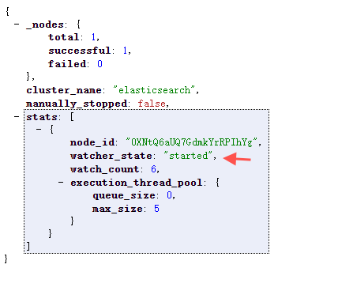

# ELK监控搭建

实现Elasticsearch监控报警，x-pack,Sentinl,Watcher 等都是可行性方案之一,如下记下最近搭建的心得

使用x-pack 监控

1：安装x-pack: Elasticsearch安装目录下执行 bin/elasticsearch-plugin install x-pack（基本上都是安装失败，本来x-pack文件很大，同时又被墙）

2：本地安装：https://artifacts.elastic.co/downloads/packs/x-pack/x-pack-6.2.4.zip

下载对应文件后执行 bin/elasticsearch-plugin install file:///path/to/file/x-pack-6.2.4.zip

具体参考：

https://www.elastic.co/guide/en/elasticsearch/reference/6.2/installing-xpack-es.html


更改 elasticsearch 的密码执行bin/x-pack/setup-passwords interactive 然后回车设置密码。

其他节点只要安装了x-pack插件的话，就可以直接加入了，无需再设置密码了。

```
#修改密码的方式
curl -H "Content-Type:application/json" -XPOST -u elastic '<http://127.0.0.1:9200/_xpack/security/user/elastic/_password>' -d '{ "password" : "changme" }'
```

config/elasticsearch.yml添加

```
#加上这条：设置x-pack为开启
xpack.security.enabled: true
设置描述
xpack.graph.enabled 设置为false禁用X-Pack图形功能。
xpack.ml.enabled 设置为false禁用X-Pack机器学习功能。
xpack.monitoring.enabled 设置为false禁用X-Pack监视功能。
xpack.reporting.enabled 设置为false禁用X-Pack报告功能。
xpack.security.enabled 设置为false禁用X-Pack安全功能。
xpack.watcher.enabled 设置false为禁用观察器。
```

验证watcher是否启动

http://localhost:9200/_watcher/stats?pretty



kibana上安装x-packkibana也采用本地安装： bin/kibana-plugin install file:x-pack-6.2.4.zip

kibana上设置es密码打开 kibana.yml 设置：

```
elasticsearch.username: "elastic"
elasticsearch.password: "changme"
```

配置报警信息

配置文件改动

```
watcher.actions.email.service.account:
    work:
        profile: gmail
        email_defaults:
            from: 'John Doe '
            bcc: archive@host.domain
        smtp:
            auth: true
            starttls.enable: true
            host: smtp.gmail.com
            port: 587
            user:
            password:
PUT _xpack/watcher/watch/log_error_watch
{
  "trigger": {
    "schedule": {
      "interval": "10s"
    }
  },
  "input": {
    "search": {
      "request": {
        "indices": ["logs"],
        "body": {
          "query": {
            "match": {
              "message": "error"
            }
          }
        }
      }
    }
  },
  "condition": {
    "compare": {
      "ctx.payload.hits.total": {
        "gt": 0
      }
    }
  },
  "actions" : {
  "send_email" : {
    "email" : {
      "to" : "POST",
      "subject" : "ELK 过去一分钟之内发生过错误请及时关注",
      "body" : "ELK 过去一分钟之内发生过错误请及时关注"
    }
  }
}
}
```

logstash配置x-pack:

```
vim ./config/logstash.conf

input {
   file {
       path => "/var/log/messages"
       type => "systemlog"
      start_position => "beginning"
       stat_interval => "3"
   }
}
output {
   if [type] == "systemlog" {
       elasticsearch {
           hosts => ["127.0.0.1:9200"]
           index => "system-log-%{+YYYY.MM.dd}"
           user => "elastic"
           password => "changme"
       }
   }
}

执行：bin/logstash -f config/logstash.conf
```

Sentinl监控插件下载地址https://github.com/sirensolutions/sentinl/releases?after=tag-6.3.2-beta-1

kibana安装目录/bin/kibana-plugin install 安装包放的位置/安装包名


sentinl使用方式：可以借鉴https://www.jianshu.com/p/2816c20f8ead

参考的资料如下：

https://www.cnblogs.com/heyongboke/p/11393069.html

https://www.elastic.co/guide/en/elasticsearch/reference/6.2/installing-xpack-es.html

https://www.cnblogs.com/cheesebar/p/9126171.html

https://www.cnblogs.com/lfwolf/p/6669812.html

https://www.jianshu.com/p/2816c20f8ead