**什么是Always On**

always on其实是指在sql server中实现高可用的解决方案之一，其实际是部署在Windows集群上的一个应用程序，是需要部署一个Windows故障转移集群（WSFC）。SQLServer集群则是部署Windows集群每个节点上的SQLServer应用。

官方文档 : AlwaysOn 可用性组概述 (SQL Server)

**第一步.安装故障转移集群**

各个服务器节点都要安装故障转移集群

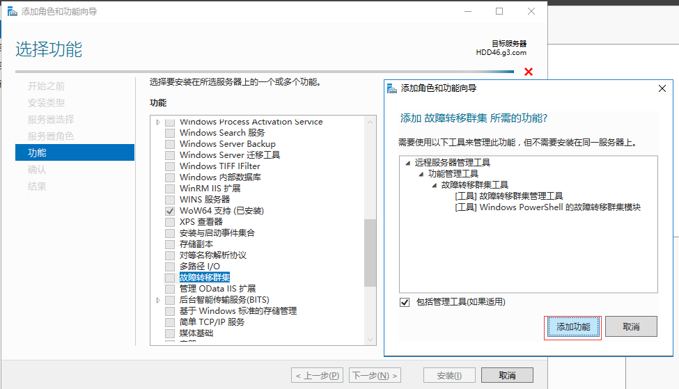

**第二步：此处演示无域搭建故障转移集群的方式，每个节点的计算机不需要加入域，但需要添加DNS后缀，且每个节点的后缀必须要相同，如下图所示的操作**

DNS后缀和主机名可以随便取，DNS后缀 各个节点一致即可

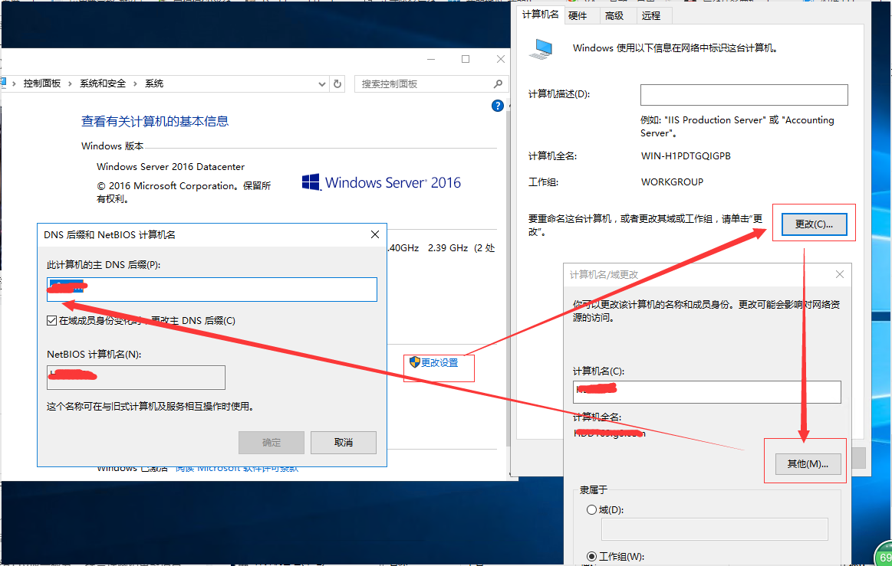

**第三步：在每个节点上都添加一个用户，且用户名以及密码每个节点都一致,并添加率属于Administrators，此处为DCAdmin.**

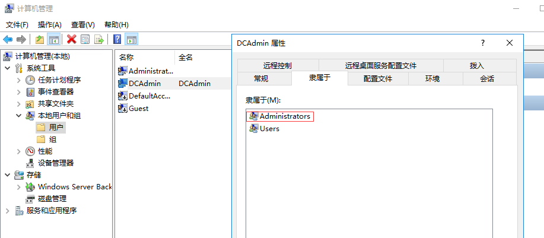

**第四步：在每个节点的 hosts 文件中添加节点的计算机信息、群集信息、侦听器信息。**

hosts文件路径：C:\Windows\System32\drivers\etc

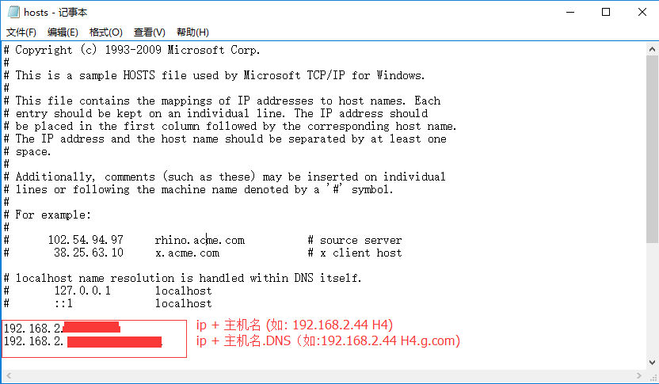

**第五步：调整sql server 服务账号，设置sql服务引擎和代理服务，登录账号调整为之前的添加的账号DCAdmin**

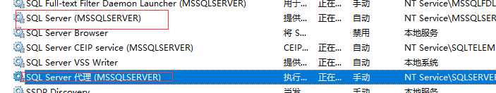

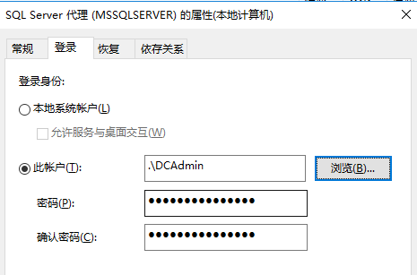

**第六步：使用sa账号登录sql server 添加前面添加的DCAdmin账号,并且赋予sysadmin权限**

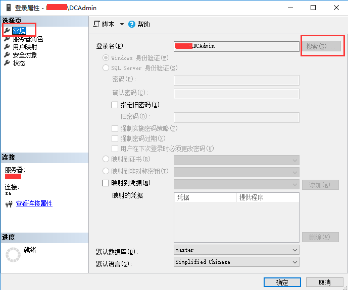

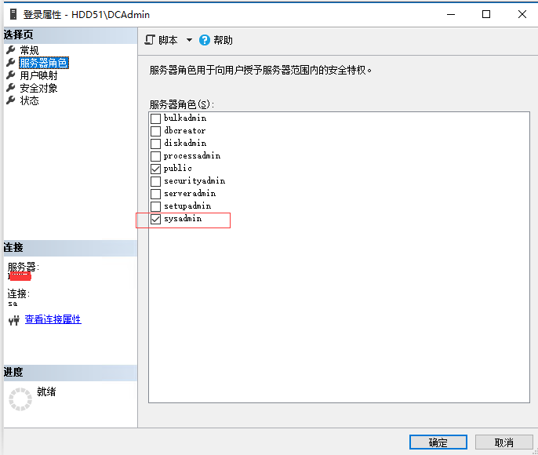

**第七步：设置内网ip4配置**

1.点击高级选择dns,如下图填入上文定义的dns

2选择WINS->NetBIOS设置，勾选禁用TCP/IP上的NetBIOS

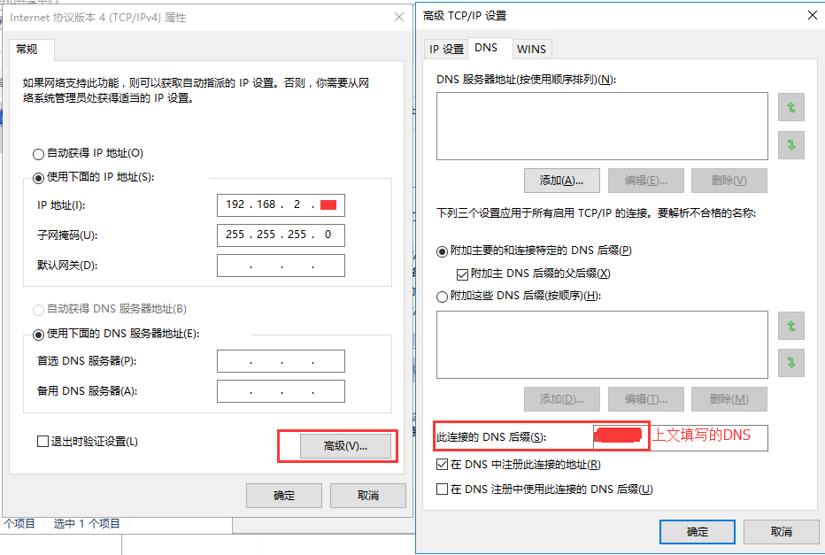

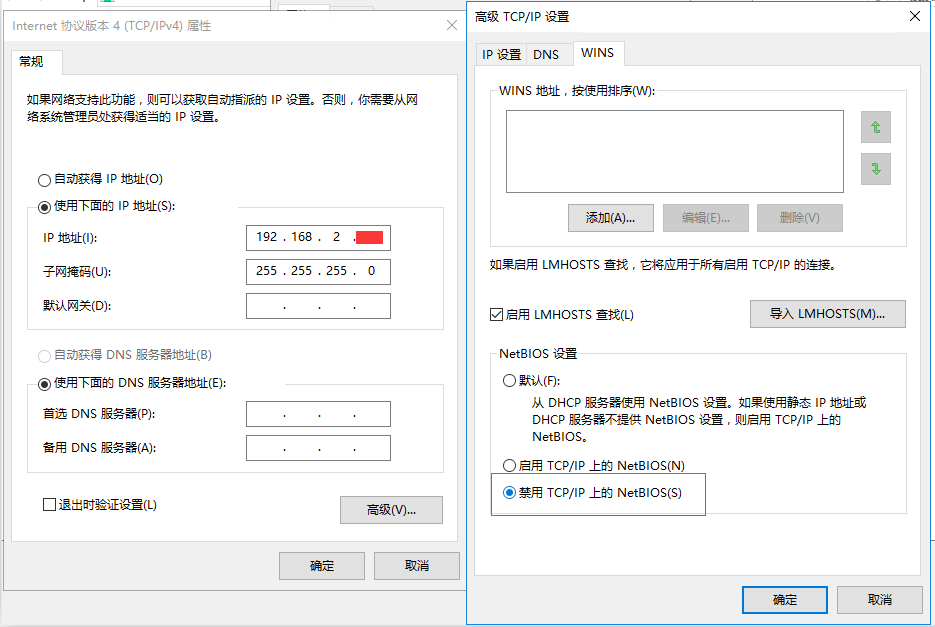

**第八步：配置注册表，把LocalAccountTokenFilterPolicy的值设置为1，配置方法：**

1.在【运行】对话框输入【regedit】，单击【确定】按钮

2.进入路径HKEY_LOCAL_MACHINE\SOFTWARE\Microsoft\Windows\CurrentVersion\Policies\System

3.新建DWORD(32位)值(D) 名称为：LocalAccountTokenFilterPolicy 值为1，16进制。

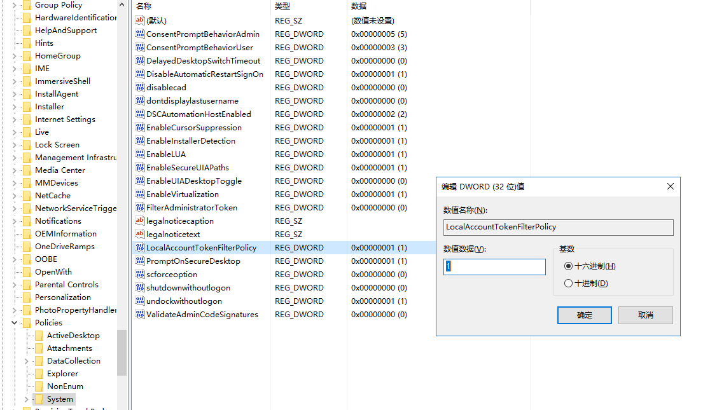

**第九步：设置允许应用和功能通过防火墙，如下图配置**

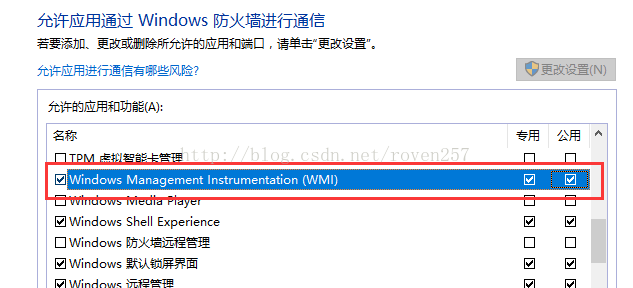

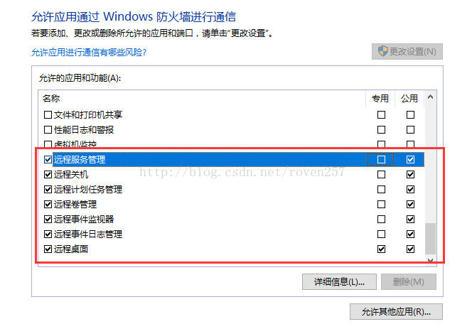

以下开始搭建故障转移集群

选择验证配置，服务机集群填入之前配置的多个节点的主机名，后选择添加即可,其它选项下一步。

生成摘要报告后选择创建集群

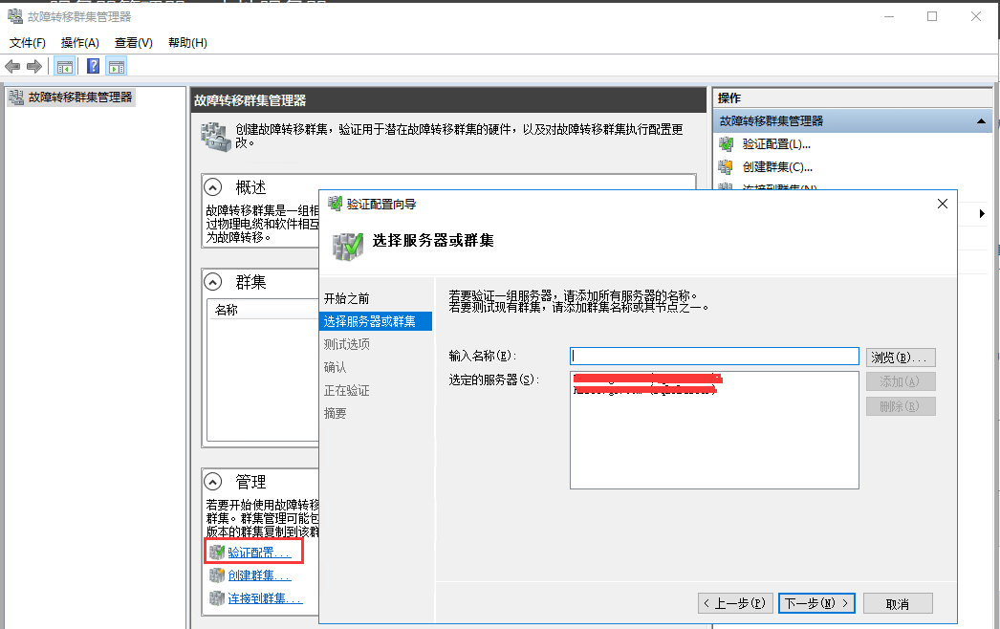

在各个节点上开启sql server alwaysOn可用性组，设置后重启服务才生效。

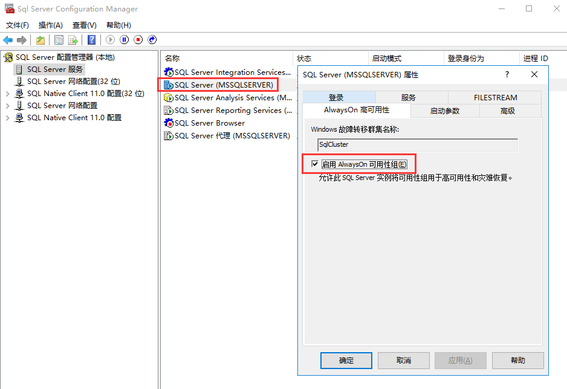

重启后查看服务器属性，确认HADR是True

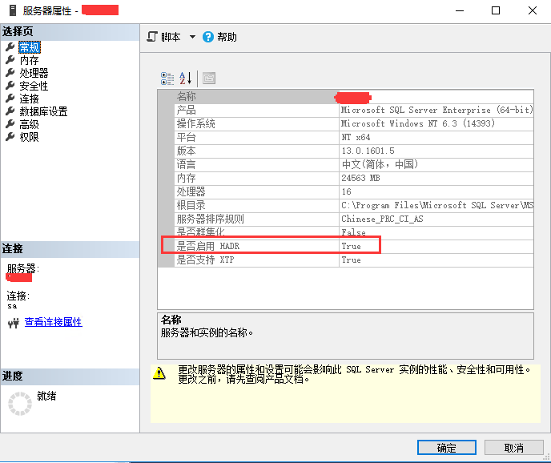

接下来是配置可用性组，可用性组侦听器 ，参考： 从0开始搭建SQL Server AlwaysOn 第三篇 第八点开始即可，就不多此一举。

最后结果如下。

参考资料

[配置sqlServer 2016 无域AlwaysOn](https://blog.csdn.net/dongxinhjj/article/details/80817333)

[从0开始搭建SQL Server AlwaysOn](https://www.cnblogs.com/lyhabc/p/4678330.html)