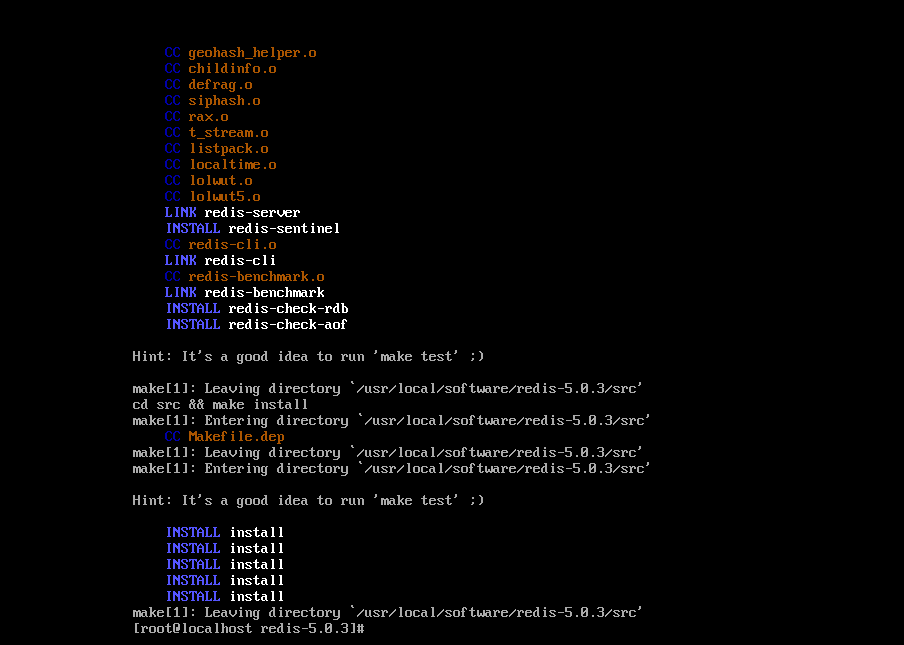
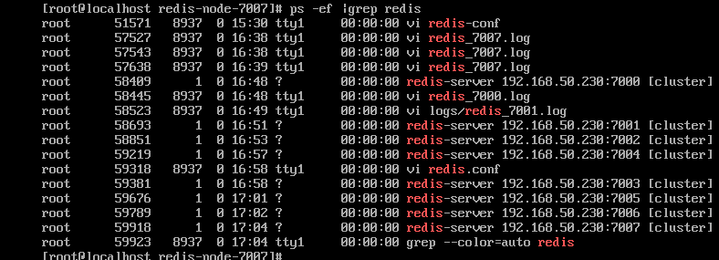
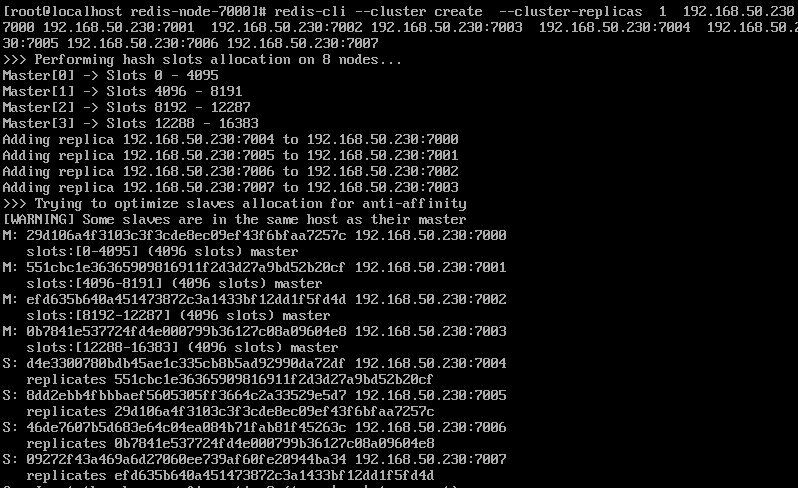
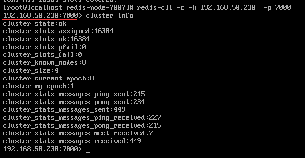

简介：Redis 集群是一个可以在多个 Redis 节点之间进行数据共享的设施（installation）。

**集群的理解**为何使用集群：解决单机故障，和单台服务器性能瓶颈的问题

提升系统负载，引入集群也引入了集群间节点通信和数据同步的一致性问题，和系统高可用的问题。


**1.安装环境依赖**

```
yum -y install gcc automake autoconf libtool make
yum install gcc-c++
```

**2.下载redis软件包，解压并安装**

```
 cd /usr/local/software
 wget <http://download.redis.io/releases/redis-5.0.3.tar.gz>
 tar xzf redis-5.0.3.tar.gz
 cd redis-5.0.3
 make && make install
```



**3.建立软件以及节点运行目录，复制配置文件**

```
cd /usr/local
mkdir redis-cluster
cd redis-cluster
mkdir redis-node-7000 redis-node-7001 redis-node-7002 redis-node-7003 redis-node-7004 redis-node-7005 redis-node-7006
redis-node-7007
cd redis-node1
mkdir logs data
cd /usr/local/software/redis-5.0.3
cp redis.conf /usr/local/redis-cluster/redis-node-7000
cp redis.conf /usr/local/redis-cluster/redis-node-7001
cp redis.conf /usr/local/redis-cluster/redis-node-7002
cp redis.conf /usr/local/redis-cluster/redis-node-7003
cp redis.conf /usr/local/redis-cluster/redis-node-7004
cp redis.conf /usr/local/redis-cluster/redis-node-7005
cp redis.conf /usr/local/redis-cluster/redis-node-7006
cp redis.conf /usr/local/redis-cluster/redis-node-7007

cd src
cp redis-cli redis-server   /usr/local/redis-cluster/redis-node-7000
cp redis-cli redis-server   /usr/local/redis-cluster/redis-node-7001
cp redis-cli redis-server   /usr/local/redis-cluster/redis-node-7002
cp redis-cli redis-server   /usr/local/redis-cluster/redis-node-7003
cp redis-cli redis-server   /usr/local/redis-cluster/redis-node-7004
cp redis-cli redis-server   /usr/local/redis-cluster/redis-node-7005
cp redis-cli redis-server   /usr/local/redis-cluster/redis-node-7006
cp redis-cli redis-server   /usr/local/redis-cluster/redis-node-7007
```

**4.修改配置文件**

```
cd /usr/local/redis-cluster/redis-node-7000
vi redis.conf
--文件内容如下
port 7000 //端口7000,7002,7003..
bind 本机ip //默认ip为127.0.0.1 需要改为其他节点机器可访问的ip 否则创建集群时无法访问对应的端口，无法创建集群
daemonize yes //redis后台运行
pidfile /usr/local/redis-cluster/redis-node-7000/redis_7000.pid //pidfile文件对应7000,7001,7002,7003,7004,7005,7006,7007
cluster-enabled yes //开启集群 把注释#去掉
cluster-config-file nodes_7000.conf //集群的配置 配置文件首次启动自动生成 7000,7001,7002,7003..
cluster-node-timeout 15000 //请求超时 默认15秒，可自行设置
appendonly yes //aof日志开启 有需要就开启，它会每次写操作都记录一条日志
logfile "/usr/local/redis-cluster/redis-node-7000/logs/redis_7000.log" //配置日志文件路径 dir "/usr/local/redis-cluster/redis-5.0.3-node/data"　　//配置数据文件存放路径
dir "/usr/local/redis-cluster/redis-node-7000/data"
```

**5.启动各个节点**cd /usr/local/redis-cluster/redis-node-7000

```
redis-server redis.conf
```

查看启动情况

```
ps -ef | grep redis
```



```
6.初始化集群（节点列表顺序用于确定主从角色，先主节点之后是从节点）

cd /usr/local/redis-cluster

redis-cli  --cluster create  --cluster-replicas  1  192.168.50.230:7000 192.168.50.230:7001  192.168.50.230:7002 192.168.50.230:7003  192.168.50.230:7004  192.168.50.230:7005 192.168.50.230:7006 192.168.50.230:7007
```



查看集群信息

```
redis-cli -c -h 192.168.50.230 -p 7000
cluster info
```



检查集群信息

```
redis-cli --cluster check 192.168.50.230:7000
```

**参考资料**

[centos7快速搭建redis集群环境](https://www.cnblogs.com/coes/p/9031939.html)

[redis5.0.0集群搭建-centos7](https://blog.csdn.net/qq_36514588/article/details/83856795)

[安装redis出现cc adlist.0 /bin/sh:1:cc:not found](http://www.mamicode.com/info-detail-1843956.html)