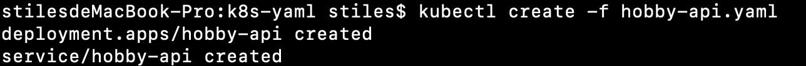
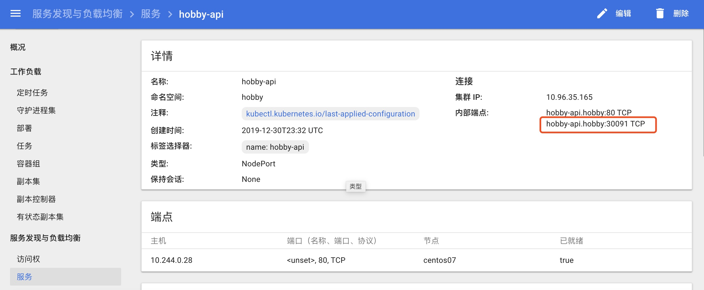

19年最后一天梳理了下部署.net core 到腾讯云kubernetes集群上面

流程如下：

1:打包镜像(使用Dockerfile)

2:上传镜像到腾讯云私有仓库

3:使用yaml文件创建Deployment,Service使容器run起来

流程很简单，让我们开始吧

1:打包镜像，在项目发布目录下，创建Dockerfile文件，内容如下

```
FROM mcr.microsoft.com/dotnet/core/aspnet:3.1-buster-slim AS base
#设定工作目录
WORKDIR /app
#在容器中程序使用的端口，一定要和程序启动使用的端口对应上
EXPOSE 80
#复制文件到工作目录
COPY . .

ENTRYPOINT ["dotnet", "Hobby_api.dll"]
```

使用docker build构建镜像

```
docker build -t 127.0.0.1:5000/hobby-api:v1.1 .
```

如无意外，docker images 可查看到镜像

2:创建私有仓库push镜像到腾讯云服务器

要先创建好宿主机/data/registry目录

```
mkdir /data/registry
docker run -itd  -p  5000:5000 -v /data/registry:/var/lib/registry  docker.io/registry
```

登录，ip可以相应改成对应ip

```
docker login 127.0.0.1:5000
```

首次使用输入登录名和密码(第一次输入对账号和密码会自动生成对应账号)

推送镜像到私有仓库

```
docker push 127.0.0.1:5000/hobby-api:v1.1
```

3:创建hobby-api.yaml文件创建Deployment,Service使容器run起来mkdir hobby-api.yaml创建命名空间

```
kubectl create namespace hobby
```

创建yaml文件apiVersion: apps/v1beta1kind: Deploymentmetadata:name: hobby-apinamespace: hobbyspec:replicas: 1selector:

```
matchLabels:
  name: hobby-api
```

template:

```
metadata:
  labels:
    name: hobby-api
spec:
  containers:
  - name: hobby-api
    image: 127.0.0.1:5000/hobby-api:v1.1
    ports:
    - containerPort: 80
```

------

apiVersion: v1kind: Servicemetadata:name: hobby-apinamespace: ho

```
bby
spec:
  selector:
    name: hobby-api
  type: NodePort
  ports:
    - nodePort: 30091
      port: 80
      protocol: TCP
      targetPort: 80
```

执行yaml

```
kubectl create -f hobby-api.yaml
```





总结了下这段时间的研究，为19年拉下序幕，感谢关注@stiles 2019-12-31