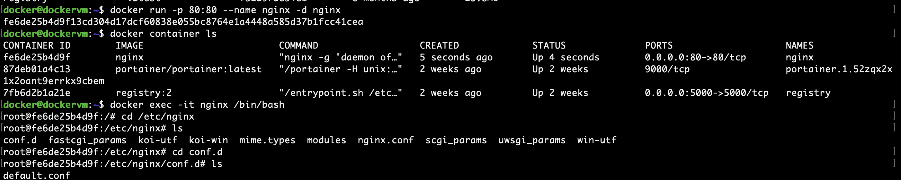
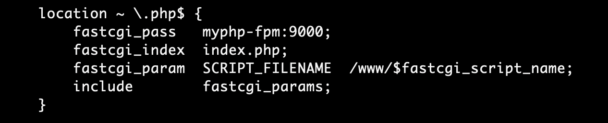

Nginx是一个高性能的HTTP和反向代理web服务器，同时也提供了IMAP/POP3/SMTP服务。

官网：https://www.nginx.com/

PHP（全称：Hypertext Preprocessor，即: 超文本预处理器"）是一种通用开源脚本语言。

官网：https://www.php.net/

**1.部署PHP环境**

1.1:拉取PHP

```
docker pull php:7.3.5-fpm
```

2.1:创建/etc/nginx/www 文件夹用于挂载PHP工作目录

```
mkdir /etc/nginx
mkdir /etc/nginx/www
```

3.1:运行PHP容器

```
docker run --name myphp-fpm -v /etc/nginx/www:/www -d php:7.3.5-fpm
```

**2:部署nginx环境**

2.1:拉取nginx镜像

```
docker pull nginx
```

2.2运行容器

```
docker run -p 80:80 --name nginx -d nginx
```

2.3:第二步运行的Nginx的配置文件是在容器内部的，不方便修改，所以我们可以先把容器内的配置文件复制到宿主机



2.4:复制容器内的配置文件到宿主机，或者仅复制conf.d文件夹内的配置文件，运行时挂载相应文件即可

```
docker cp -a nginx:/etc/nginx/ /etc/nginx/conf
```

2.5:停止Nginx容器并删除

```bash
docker stop nginx
docker rm nginx
```

2.6:重新运行容器，并挂载我们在第三步复制出来的配置文件目录

```bash
mkdir /etc/nginx/logs
docker run -d -p 80:80 --restart always --link myphp-fpm:php --name nginx -v /etc/nginx/www:/usr/share/nginx/html -v /etc/nginx/conf/:/etc/nginx/ -v /etc/nginx/logs:/var/log/nginx nginx
```

2.7:添加测试文件

```
mkdir vi /etc/nginx/index.html
内容：ok nginx
```

访问localhost:80(我是部署在虚拟机，8080是宿主机和docker虚拟机端口80的映射端口)


2.8:修改nginx配置

```
vi /etc/nginx/conf/conf.d/default.conf
```

如下图



fastcgi_pass myphp-fpm:9000; #将请求代理到容器myphp-fpm到9000端口

# **这个命令是指定将http代理到哪个fastcgi服务端接口。fastcgi_pass后面是填写fastcgi服务端地址的，这个地址可以是域地址，也可以是Uninx-域套接字。**

fastcgi_param SCRIPT_FILENAME $/www/$fastcgi_script_name;

# **脚本文件请求的路径 (/www/ 映射宿主机挂载的/etc/nginx/www目录，这里是个大坑)**

2.9:创建index.php文件测试结果

```
vi /etc/nginx/www/index.php
```

内容如下


重启nginx容器使配置生效

```
docker restart nginx
```

如无意外访问localhost:80/index.php 可看到如下界面