# 基于Jenkins+tfs+msbuild实现自动发布

Jenkins是一款开源 CI&CD 软件，用于自动化各种任务，包括构建、测试和部署软件.

官网地址:Jenkins, 默认端口8080

**初始化jenkins**

1.浏览器输入：

http://localhost:8080

解锁jenkins

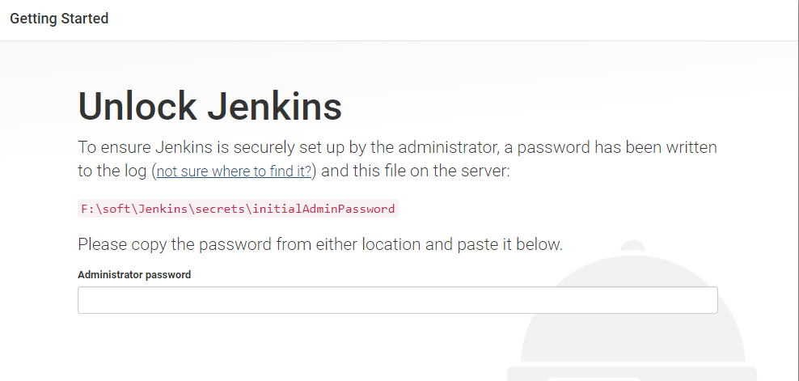

在如图所示的路径下面打开initialAdminPassword文件，复制密码输入即可

2.自定义Jenkins ，选择安装推荐的插件

1. 安装MSBuild和TFS插件安装

在Manage Jenkins 的 Manage Plugin 里面我们找到 MSBuild 和 Team Foundation Server Plug-in 插件，勾选，点击 Download now and install after restart 按钮，勾选 Restart Jenkins when installation is complete and no jobs are running 。

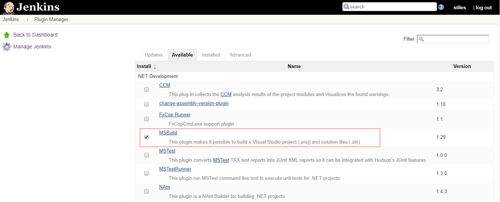

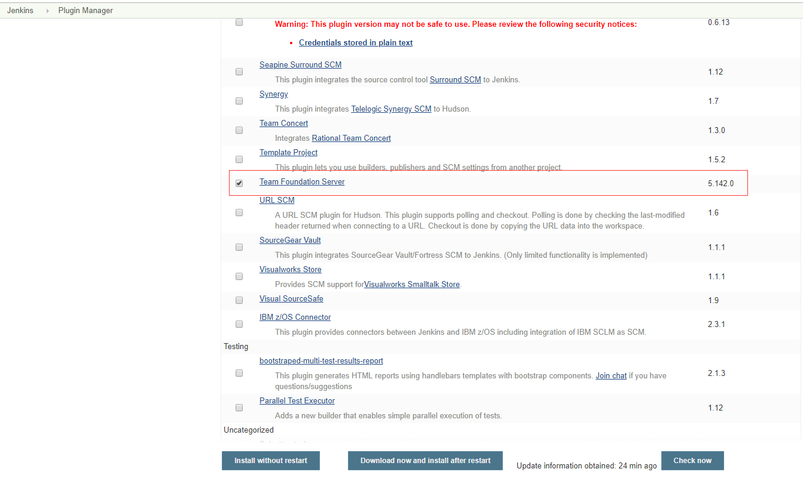

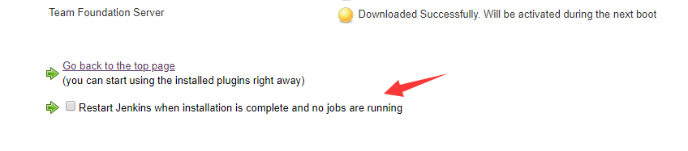

安装完成之后 Jenkins 会重启，等待重启完毕之后，来到 Jenkins>>Global Tool Configuration 查看 MSBuild配置msbuild的路径，我这边是安装了vs2017在安装目录下面可以找到MSBuild路径，如下图：

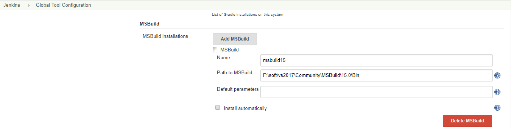

**项目构建**

选择FreeStyle Project(自由风格的构建)，相关配置如下图

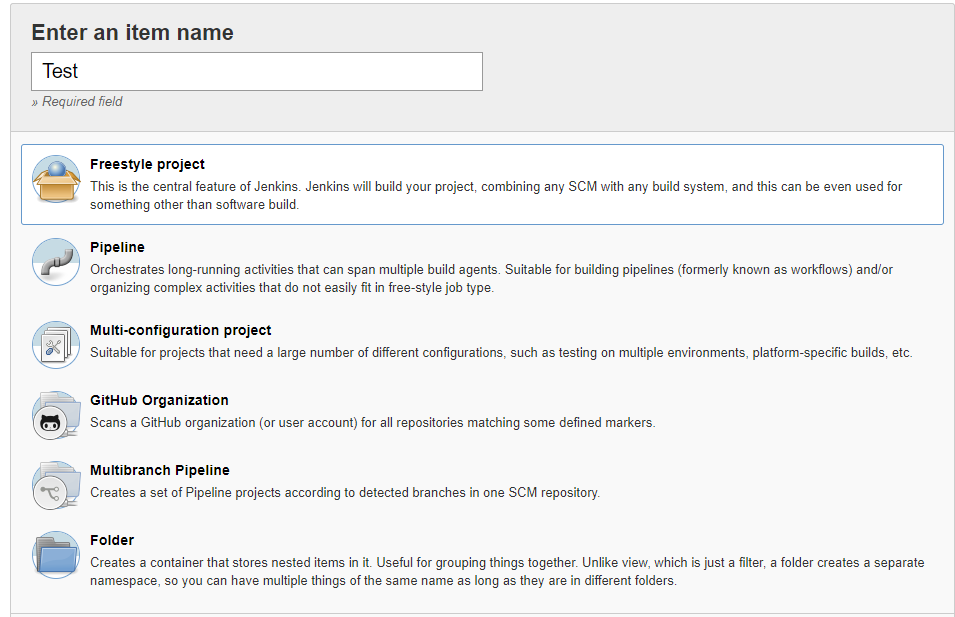

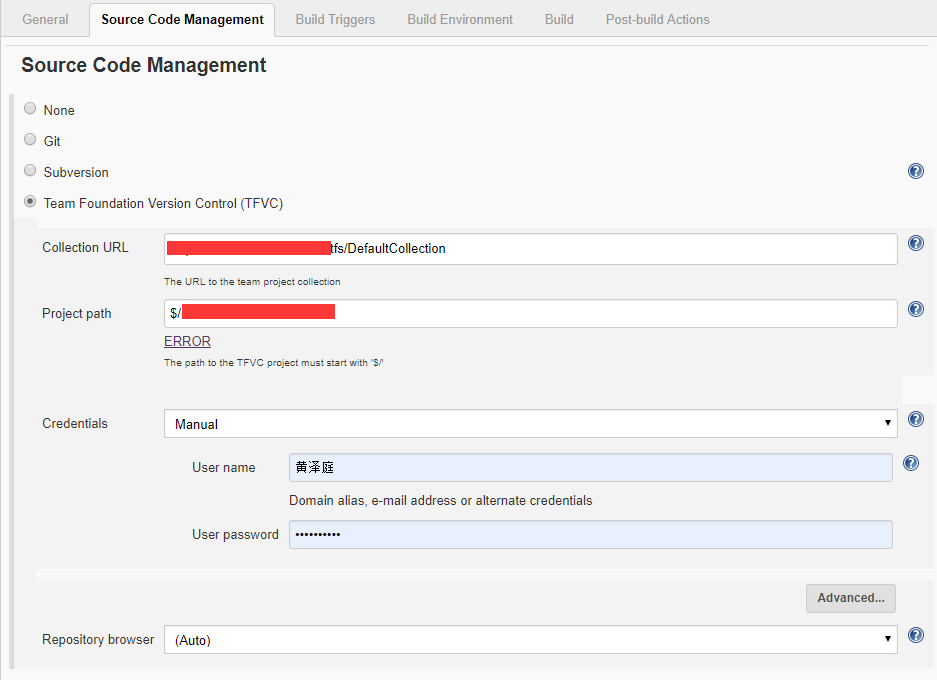

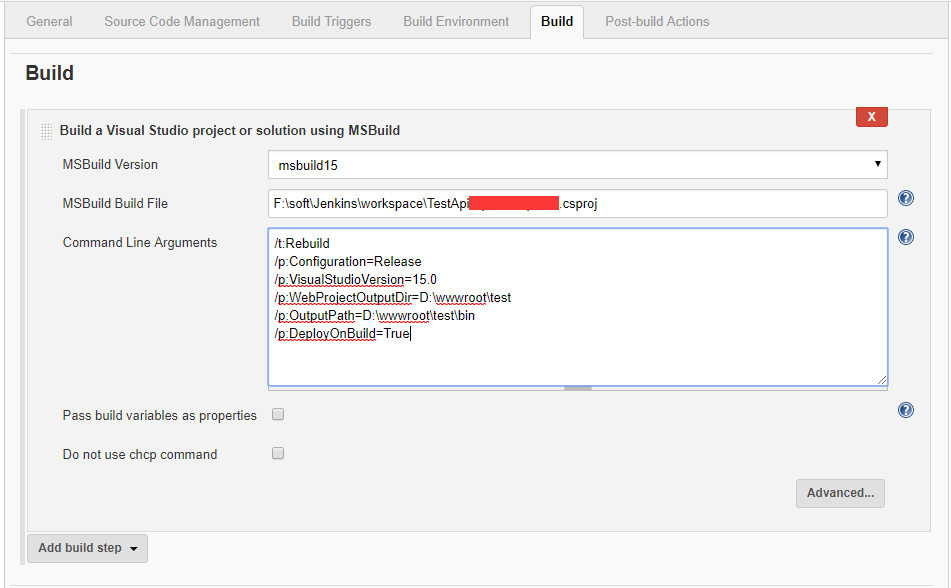

MSBuild参数说明如下：

/t:Rebuild (每次都是重新构建)/p:Configuration=Release （构建的是发布版本）/p:VisualStudioVersion=15.0 （vs的版本,使用的是2017填写的是15.0）/p:WebProjectOutputDir=D:\wwwroot\test （发布路径）/p:OutputPath=D:\wwwroot\test\bin (输出路径)/p:DeployOnBuild=True （表示启用编译并发布）

msbuild文档：

msbuild15版本离线下载文件：

执行windows批处理命令复制目录文件到对应站点下面

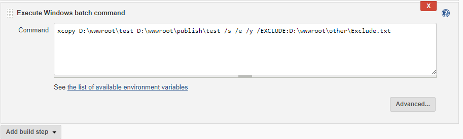

xcope source [destination] [命令参数]

source 指定要复制的文件

destination 指定新文件的位置和/或名称。

/s 复制目录和子目录，除了空的

/e 复制目录和子目录，包括空的

/y 禁止提示以确认改写一个现存目标文件

/s /e /y 表示完成拷贝； exclude

exclude 指定含有字符串的文件列表。每个字符串在文件中应位于单独的一行。如果任何字符串与复制文件的绝对路径的任何部分相符，则排除复制该文件。例如，指定如 \obj\ 或 .obj 的字符串会分别排除目录 obj 下面的所有文件或带有.obj 扩展名的所有文件。

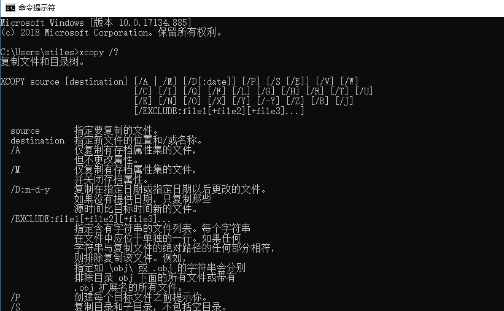

手动构建项目,完成构建-发布的流程

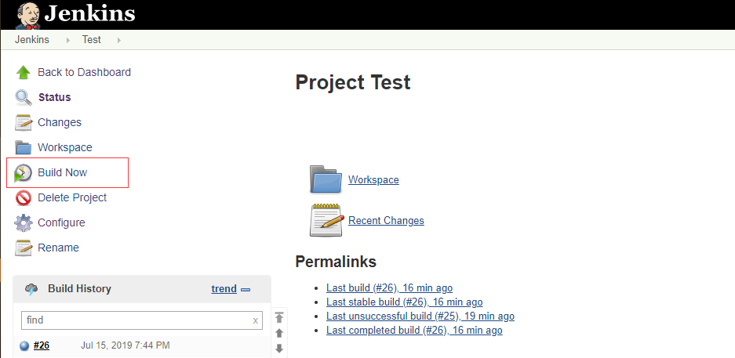

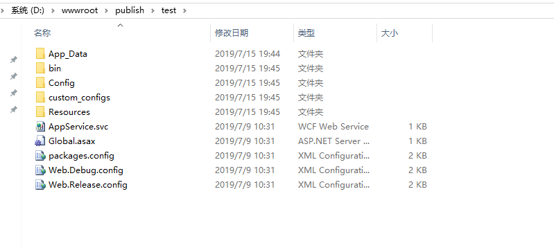

**总结**

整个流程通过tfs 拉取项目到jenkins安装目录的workspace目录下面，再通过msbuild编译和预发布到指定的目录，确保无误之后再通过windows xcopy命令覆盖到指定站点路径下面（此处根据需要还可以添加站点的备份）完成整个自动编译到发布的流程。

**参考资料**

[jekins+TFS+MsBuild实现.net的持续集成，自动化部署](https://www.cnblogs.com/tianyang1027/p/10333454.html)

[.NET Core微服务之基于Jenkins+Docker实现持续部署（Part 1）](https://www.cnblogs.com/edisonchou/p/CD_foundation_based_on_jenkins_and_docker.html)