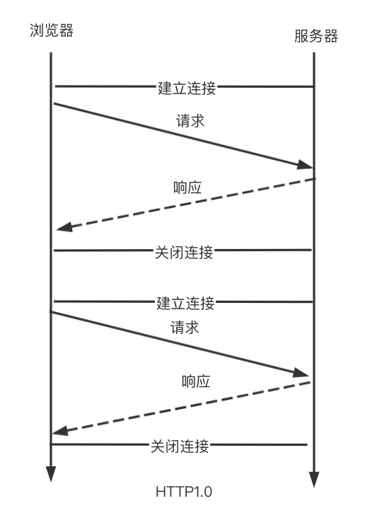
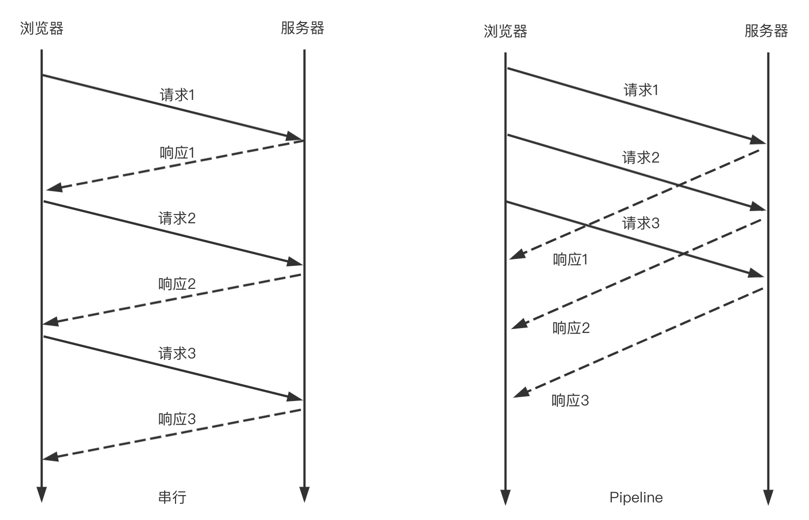
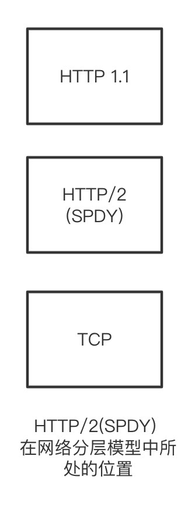
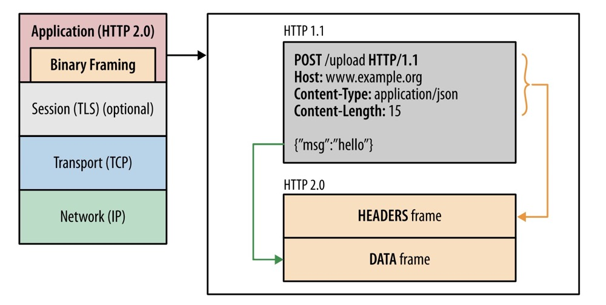
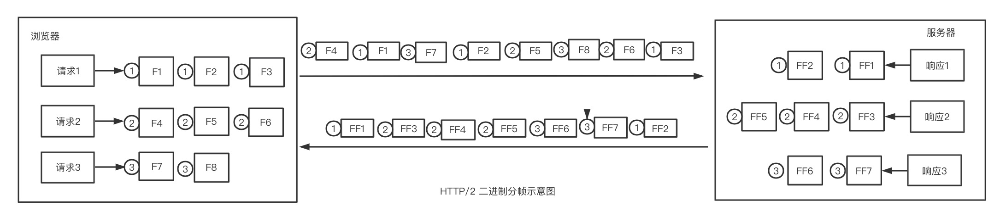
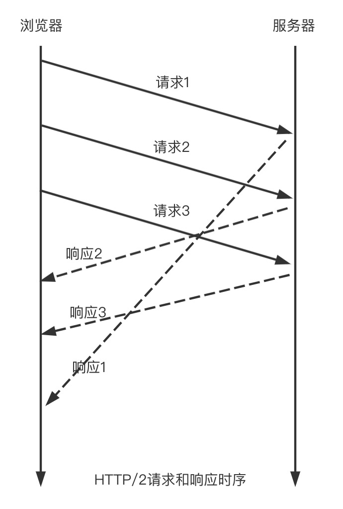
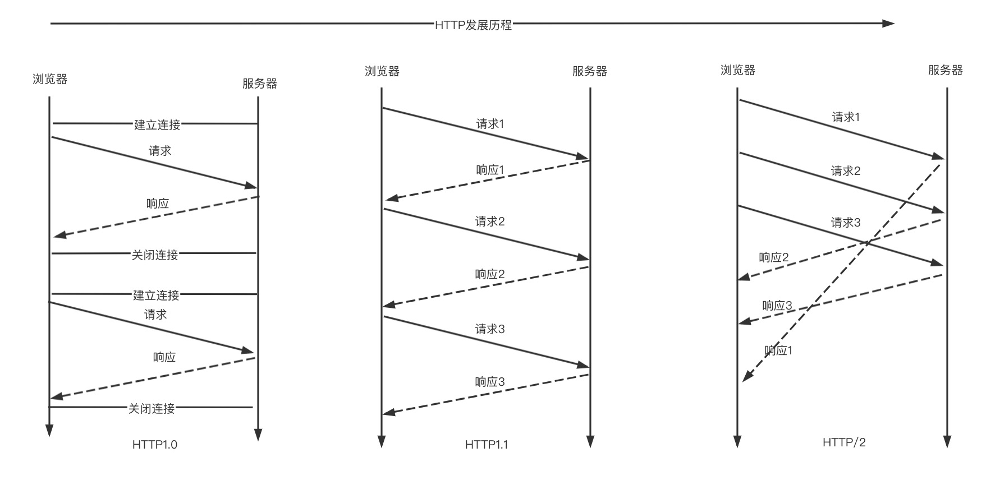
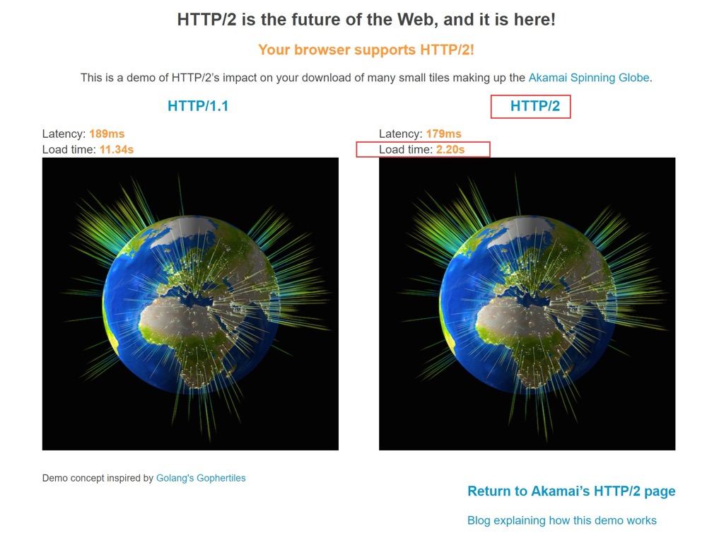

# HTTP协议发展历程

HTTP代表(Hyper Text Transfer Protocol)超文本传输协议。是一种用于分布式、协作式和超媒体信息系统的应用层协议。网络协议很多种,HTTP是万维网的数据通信的基础。

1996年,HTTP1.0协议规范[RFC1945](http://www.ietf.org/rfc/rfc1945.txt)发布.

1999年,HTTP1.1协议规范[RFC2616](http://www.ietf.org/rfc/rfc2616.txt)发布.

2015年,HTTP/2协议规范[RFC7540](http://www.ietf.org/rfc/rfc7540.txt)/[7541](http://www.ietf.org/rfc/rfc7541.txt)发布.

- HTTP/2还没达到普及的程度,目前主流的协议还是HTTP1.1.

## **HTTP1.0**

HTTP1.0:无状态,无连接的应用层协议,客户端和服务端的通信每次请求都是“一来一回“的短链接,每发起一个请求时都会创建一个新的连接，并在收到应答时立即关闭。

1:每次请求都是独立的(无状态)

2:每次都创建一个新的TCP请求(无法复用)

3:下个请求需要等待上个请求响应关闭完毕才能发送(队头阻塞)



为了解决这些问题，

```
HTTP1.1
```

出现了。

## **HTTP1.1**

对于`HTTP1.1`，不仅继承了`HTTP1.0`简单的特点，还克服了诸多`HTTP1.0`性能上的问题。

连接复用(**长连接**)

HTTP1.1增加了一个Connection字段，通过设置`Keep-Alive`可以保持`HTTP`连接不断开，避免了每次客户端与服务器请求都要重复建立TCP连接，提高了网络的利用率。如果客户端想关闭HTTP连接，可以在请求头中携带`Connection: false` 来告知服务器关闭请求。

- 减少了建立和关闭连接的开销

管道化

**Pipeline机制**

在同一个Tcp连接上面,可以在请求发出去之后,响应没有回来之前,就可以发送下一个,再下一个请求,提高了在同一个Tcp连接上面的处理请求的效率,下图展示了串行和Pipeline对比.



- 提高单个TCP连接请求并发

需要注意的是，**服务器必须按照客户端请求的先后顺序依次回送相应的结果，以保证客户端能够区分出每次请求的响应内容。**

基于需要保证响应请求的顺序,故和HTTP1.0一样会有队头阻塞(Head-of-line Blocking)问题

如上图如果请求1发生了延迟,那么请求2和请求3的响应会被阻塞,知道服务器返回请求1的响应

也正因为如此,为了避免Pipeline机制的副作用,很多浏览器默认把Pipeline关闭了.

**缓存处理（强缓存和协商缓存[[传送门](http://www.yangzicong.com/article/12)]）\**新的字段如`cache-control`，支持\**断点传输**，以及增加了**Host字段**（使得一个服务器能够用来创建多个Web站点）。

## **HTTP/2**

**SPDY**

SPDY是谷歌开发的一个实验性协议，于2009年年中发布，其主要目标是通过解决HTTP1.1中广为人知的一些性能限制，来减少网页的加载延迟。SPDY引入了一个新的二进制分帧数据层，以实现多向请求和响应、优先次序、最小化及消除不必要的网络延迟，目的是更有效利用底层TCP连接。

几年后的2012年，这个新的实验性协议得到了Chrome、Firefox和Opera的支持，很多大型网站都对兼容客户端提供SPDY会话。最终，HTTP-WG在2012年吸取了SPDY的经验教训，并在此基础上制定了HTTP/2官方标准。



**二进制分帧**(解决队头阻塞问题)

HTTP2.0通过在应用层和传输层之间增加一个二进制分帧层，突破了`HTTP1.1`的性能限制、改进传输性能

HTTP1.1本身是明文的字符格式,所谓的二进制分帧,是指在把这个字符格式的报文给TCP之前转换成二进制,并且分成多个帧(多个数据块)来发送.

帧是最小的通信单位，承载着特定类型的数据，例如 HTTP 标头、消息负载等等。 来自不同数据流的帧可以交错发送，然后再根据每个帧头的数据流标识符重新组装。





HTTP/2 把请求和响应通过

**分帧**

并且给每个帧打上流的 ID 去避免依次响应的问题，对方接收到帧之后根据 ID 拼接出流，这样就可以做到乱序响应从而避免请求时的队首阻塞问题。

- 并行交错地发送多个请求，请求之间互不影响。
- 并行交错地发送多个响应，响应之间互不干扰。
- 使用一个连接并行发送多个请求和响应。
- 不必再为绕过 HTTP/1.x 限制而做很多工作（请参阅[针对 HTTP/1.x 进行优化](https://hpbn.co/optimizing-application-delivery/#optimizing-for-http1x)，例如级联文件、image sprites 和域名分片。
- 消除不必要的延迟和提高现有网络容量的利用率，从而减少页面加载时间。
- 等等...

有了二进制分帧,在HTTP层面请求和响应都是并发进行的



更多细节:

[点击](https://developers.google.com/web/fundamentals/performance/http2?hl=zh-cn)

**HTTP发展历程**



## **对比**

HTTP 2.0 对 HTTP 的延迟问题起到了可以说是一个巨大的优化。下面的链接是网上的一个直观网站，它展示了同样是 300 多张图片，分别在 HTTP 1.1 和 HTTP 2.0 协议下加载的耗时。HTTP 2.0 的速度差不多是 HTTP 1.1 的6倍。

[演示](https://http2.akamai.com/demo)



## **总结**

总结了下http的发展脉络希望对你有帮助

*以上内容采集于网络由个人汇总整理,如有侵权请告知后及时删除.

*转载：请注明出处 http://stiles.cc/archives/170/

**参考资料**

https://developers.google.com/web/fundamentals/performance/http2?hl=zh-cn

https://juejin.cn/post/6844903796225785870

https://book.douban.com/subject/30443578/

https://segmentfault.com/a/1190000020042105