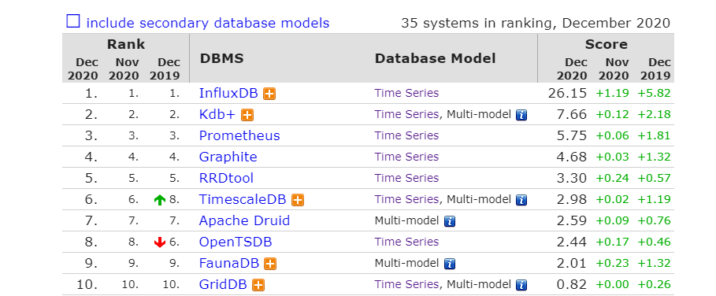
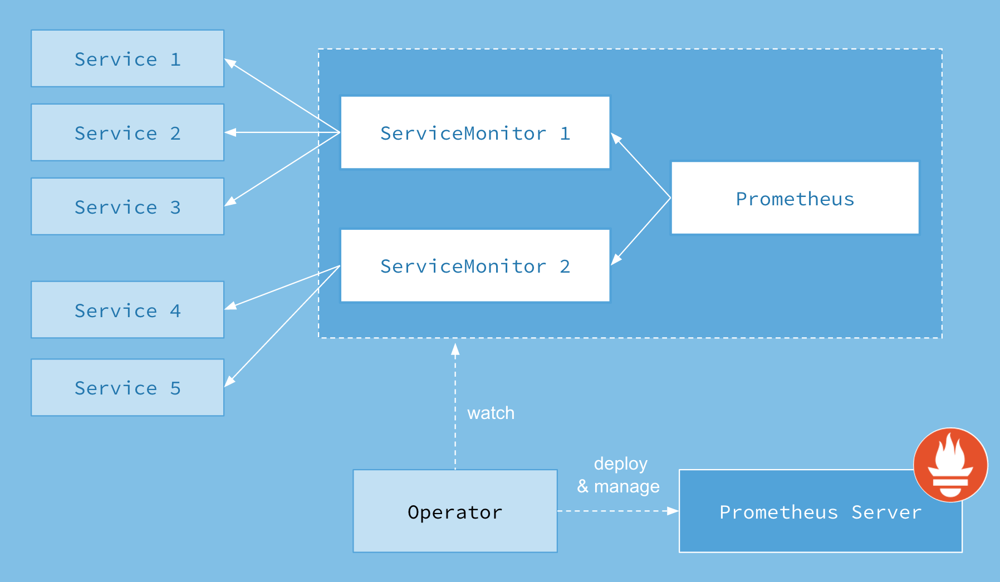
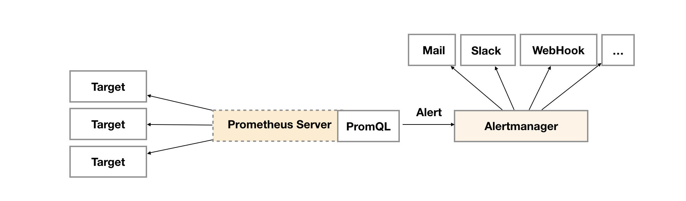
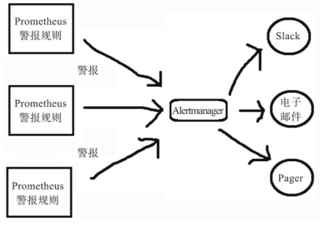
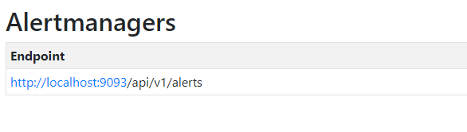

# Prometheus监控介绍

**1：Prometheus简介：**

既是一个时序数据库，又是一个监控系统，更是一套开源的完备监控生态解决方案。

Prometheus受启发于Google的Brogmon监控系统,从2012年开始由前Google工程师在Soundcloud以开源软件的形式进行研发，并且于2015年早期对外发布早期版本。2016年5月继Kubernetes之后成为第二个正式加入CNCF基金会的项目，同年6月正式发布1.0版本。2017年底发布了基于全新存储层的2.0版本，能更好地与容器平台、云平台配合。

**作为时序数据库**

点击链接查看排名：https://db-engines.com/en/ranking/time+series+dbms 



**作为监控系统**

它从应用程序中实时获取时间序列数据，然后通过功能强大的规则引擎，帮助你识别监控环境所需的信息。

特点：

1：通过PromQL实现多维度数据模型的灵活查询。

2：定义了开放指标数据的标准，自定义探针（如Exporter等），编写简单方便。

3：PushGateway组件让这款监控系统可以接收监控数据。

4：提供了VM和容器化的版本。

5：采用拉模式为主、推模式为辅的方式采集数据。

6：支持多种语言的客户端，如Java、JMX、Python、Go、Ruby、.NET、Node.js等语言。

7：支持本地和第三方远程存储，单机性能强劲，可以处理上千target及每秒百万级时间序列。

8：高效的存储。平均一个采样数据占3.5B左右，共320万个时间序列，每30秒采样一次，如此持续运行60天，占用磁盘空间大约为228GB（有一定富余量，部分要占磁盘空间的项目未在这里列出）

9：出色的可视化功能。Prometheus拥有多种可视化的模式，比如内置表达式浏览器、Grafana集成和控制台模板语言。它还提供了HTTP查询接口，方便结合其他GUI组件或者脚本展示数据。不一一列举

下图是prometheus的体系结构和对应的生态组件


prometheus是一个开源的监控告警系统，具有由度量名称和键/值对标识的时间序列数据的多维数据模型、灵活的查询语言，监控模式是通过HTTP主动去拉取exporters上基于时间序列的监控采集数据，同时也能通过中间网关来支持推送型的监控数据收集，所有的监控目标都是通过配置型的或是服务发现，或是静态配置，提供了HTTP页面支持图形和仪表盘的展示。

**2：什么是Prometheus Operator**

Git 地址：https://github.com/prometheus-operator/prometheus-operatorpromethues-operator是一个通过监听K8s内CRD资源的变更操作事件来自动创建，配置并管理prometheus监控系统的一个控制器。

为了在Kubernetes能够方便的管理和部署Prometheus，我们使用ConfigMap来管理Prometheus配置文件。每次对Prometheus配置文件进行升级时，我们需要手动移除已经运行的Pod实例，从而让Kubernetes可以使用最新的配置文件创建Prometheus。 而如果当应用实例的数量更多时，通过手动的方式部署和升级Prometheus过程繁琐并且效率低下。

The Operator encapsulates a large part of the Prometheus domain knowledge and only surfaces aspects meaningful to the monitoring system's end user. It's a powerful approach that enables engineers across all teams of an organization to be autonomous and flexible in the way they run their monitoring.

下图是Prometheus Operator架构图



Operator是核心部分，作为一个控制器而存在，Operator会创建Prometheus、ServiceMonitor、AlertManager及PrometheusRule这4个CRD资源对象，然后一直监控并维持这4个CRD资源对象的状态

- Prometheus: 声明式创建和管理Prometheus Server实例
- ServiceMonitor: 负责声明式的管理监控配置,资源对象是专门提供metrics数据接口的exporter的抽象，Prometheus就是通过ServiceMonitor: 提供的metrics数据接口去 pull 数据的
- AlerManager: 声明式的创建和管理Alertmanager实例
- PrometheusRule 资源对象是被Prometheus实例使用的告警规则配置

**3：kubernetes 上部署Prometheus**

方式1：原生自建 [点击](https://yunlzheng.gitbook.io/prometheus-book/part-iii-prometheus-shi-zhan/readmd/deploy-prometheus-in-kubernetes)方式2：Prometheus Operator：[点击](https://yunlzheng.gitbook.io/prometheus-book/part-iii-prometheus-shi-zhan/operator/what-is-prometheus-operator)

- Prometheus Operator 使用CustomResourceDefinition 来自定义资源，而CustomResourceDefinition 需要依赖kubernetes 1.16版本之上具体细节：CustomResourceDefinition 版本：https://kubernetes.io/zh/docs/tasks/extend-kubernetes/custom-resources/custom-resource-definition-versioning/

**4：Prometheus告警定义**

告警能力在Prometheus的架构中被划分成两个独立的部分。如下所示，通过在Prometheus中定义AlertRule（告警规则），Prometheus会周期性的对告警规则进行计算，如果满足告警触发条件就会向Alertmanager发送告警信息。



**4.1.告警规则组成**

在Prometheus中一条告警规则主要由以下几部分组成：

- 告警名称：用户需要为告警规则命名，当然对于命名而言，需要能够直接表达出该告警的主要内容
- 告警规则：告警规则实际上主要由PromQL进行定义，其实际意义是当表达式（PromQL）查询结果持续多长时间（During）后出发告警

一条典型的告警规则如下所示：

```
groups:
- name: example
  rules:
  - alert: HighErrorRate
    expr: job:request_latency_seconds:mean5m{job="myjob"} > 0.5
    for: 10m
    labels:
      severity: page
    annotations:
      summary: High request latency
      description: description info
```

在告警规则文件中，我们可以将一组相关的规则设置定义在一个group下。在每一个group中我们可以定义多个告警规则(rule)。一条告警规则主要由以下几部分组成：

alert：告警规则的名称。

expr：基于PromQL表达式告警触发条件，用于计算是否有时间序列满足该条件。

for：指定Prometheus服务等待时间，可选参数。用于表示只有当触发条件持续一段时间后才发送告警。在等待期间新产生告警的状态为pending。

labels：自定义标签，允许用户指定要附加到告警上的一组附加标签，任何已存在的冲突标签都会被重写。

annotations：用于指定一组附加信息，比如用于描述告警详细信息的文字等，annotations的内容在告警产生时会一同作为参数发送到Alertmanager。

**4.2.如何启用告警规则**

在Prometheus全局配置文件中通过rule_files指定一组告警规则文件的访问路径，Prometheus启动后会自动扫描这些路径下规则文件中定义的内容，并且根据这些规则计算是否向外部发送通知：

```
rule_files:
  [ - <filepath_glob> ... ]

#例如：
rule_files:
- /etc/prometheus/rules/*.yml
```

默认情况下Prometheus会每分钟对这些告警规则进行计算，如果用户想定义自己的告警计算周期，则可以通过evaluation_interval来覆盖默认的计算周期：

```
global:
  [ evaluation_interval: <duration> | default = 1m ]
```

**4.3.模板化**

一般来说，在告警规则文件的annotations中使用summary描述告警的概要信息，description用于描述告警的详细信息。同时Alertmanager的UI也会根据这两个标签值，显示告警信息。为了让告警信息具有更好的可读性，Prometheus支持模板化label和annotations中的标签的值。

通过$labels.<labelname>变量可以访问当前告警实例中指定标签的值。$value则可以获取当前PromQL表达式计算的样本值

```
# To insert a firing element's label values:
{{ $labels.<labelname> }}
# To insert the numeric expression value of the firing element:
{{ $value }}
```

例如，可以通过模板化优化summary以及description的内容的可读性：

```
groups:
- name: example
  rules:
  # Alert for any instance that is unreachable for >5 minutes.
  - alert: InstanceDown
    expr: up == 0
    for: 5m
    labels:
      severity: page
    annotations:
      summary: "Instance {{ $labels.instance }} down"
      description: "{{ $labels.instance }} of job {{ $labels.job }} has been down for more than 5 minutes."
  # Alert for any instance that has a median request latency >1s.
  - alert: APIHighRequestLatency
    expr: api_http_request_latencies_second{quantile="0.5"} > 1
    for: 10m
    annotations:
      summary: "High request latency on {{ $labels.instance }}"
      description: "{{ $labels.instance }} has a median request latency above 1s (current value: {{ $value }}s)"
```

**4.4.警报触发**

Prometheus以一个固定时间间隔来评估所有规则，这个时间由evaluate_interval定义，我们将其设置为15秒。在每个评估周期，Prometheus运行每个警报规则中定义的表达式并更新警报状态。警报可能有以下三种状态：Inactive：警报未激活。Pending：警报已满足测试表达式条件，但仍在等待for子句中指定的持续时间。Firing：警报已满足测试表达式条件，并且Pending的时间已超过for子句的持续时间。

Pending到Firing的转换可以确保警报更有效，且不会来回浮动。没有for子句的警报会自动从Inactive转换为Firing，只需要一个评估周期即可触发。带有for子句的警报将首先转换为Pending，然后转换为Firing，因此至少需要两个评估周期才能触发。

**5：AlertManager告警管理**

描述：alertmanager可以接受prometheus报警，由prometheus来定义满足什么条件的发送告警到alertmanager

**5.1.Alertmanager如何工作?**

Alertmanager处理从客户端发来的警报，客户端通常是Prometheus服务器如图所示。它还可以接收来自其他工具的警报。Alertmanager对警报进行去重、分组，然后路由到不同的接收器，如电子邮件、短信或SaaS服务（PagerDuty等）。你还可以使用Alertmanager管理维护。



**5.2.关联Prometheus与Alertmanager**

在Prometheus的架构中被划分成两个独立的部分。Prometheus负责产生告警，而Alertmanager负责告警产生后的后续处理。因此Alertmanager部署完成后，需要在Prometheus中设置Alertmanager相关的信息。

编辑Prometheus配置文件,并添加以下内容

```
alerting:
  alertmanagers:
    - static_configs:
        - targets: ['localhost:9093']
```

完成后重启Prometheus服务，通过

http://127.0.0.1/status

的alertmanagers节点查看是否绑定成功



**5.3.Alertmanager配置详解**

Alertmanager主要负责对Prometheus产生的告警进行统一处理，因此在Alertmanager配置中一般会包含以下几个主要部分：

全局配置（global）：用于定义一些全局的公共参数，如全局的SMTP配置，Slack配置等内容；模板（templates）：用于定义告警通知时的模板，如HTML模板，邮件模板等；告警路由（route）：根据标签匹配，确定当前告警应该如何处理；接收人（receivers）：接收人是一个抽象的概念，它可以是一个邮箱也可以是微信，Slack或者Webhook等，接收人一般配合告警路由使用；抑制规则（inhibit_rules）：合理设置抑制规则可以减少垃圾告警的产生

简单的示例：

```
global:
  #在没有报警的情况下声明为已解决的时间
  resolve_timeout: 5m
route:
  #这里的标签列表是接受到告警信息后的重新分组标签，例如,在接收到告警信息里有许多具有cluster=A和alertname=LatncyHigh标签的告警信息会被批量聚合到一个分组里
  group_by: ['alertname','cluster']
  #在一个新的告警分组被创建后，需要等待至少group_wait时间来初始化通知，这种方式可以确保有足够的时间为同一分组获取多条报警，然后一起触发这条告警信息
  group_wait: 30s
  #在第1条告警发送后，等待group_interval时间来发送新的一组告警信息
  group_interval: 2m
  #如果某条告警信息已经发送成功，则等待repeat_interval时间重新发送它们
  repeat_interval: 2m
  #默认的receiver:如果某条告警没有被一条route匹配，则发送给默认的接收器
  receiver: 'webhook'
receivers:
- name: 'webhook'
  webhook_configs:
  - url: '<http://ip>'
    send_resolved: true
```

更多细节查看官网：https://prometheus.io/docs/alerting/latest/configuration/

**6：3大监控方法论**

1.Google的四大黄金指标

2.Netflix的USE方法

3.Weave Cloud的RED方法*监控方法提供的指导原则可以让你缩小范围并专注于所收集的海量时间序列中的特定指标。

**6.1.Google的四大黄金指标**

有4个来自Google SRE手册的黄金指标，这4个指标主要针对应用程序或用户部分。

**延迟（Latency）**：服务请求所需耗时，例如HTTP请求平均延迟。需要区分成功请求和失败请求，因为失败请求可能会以非常低的延迟返回错误结果。

**流量（Traffic）**：衡量服务容量需求（针对系统而言），例如每秒处理的HTTP请求数或者数据库系统的事务数量。

**错误（Errors）**：请求失败的速率，用于衡量错误发生的情况，例如HTTP 500错误数等显式失败，返回错误内容或无效内容等隐式失败，以及由策略原因导致的失败（比如强制要求响应时间超过30ms的请求为错误）。

**饱和度（Saturation）**：衡量资源的使用情况，例如内存、CPU、I/O、磁盘使用量（即将饱和的部分，比如正在快速填充的磁盘）。

- Google专注于应用程序级监控，Google的四个黄金指标: https://sre.google/sre-book/monitoring-distributed-systems
- **6.2.Netflix的USE方法**USE是Utilization（使用率）、Saturation（饱和度）、Error（错误）的首字母组合，是Netflix的内核和性能工程师Brendan Gregg提出的，主要用于分析系统性能问题，可以指导用户快速识别资源瓶颈及错误。
- **使用率**：关注系统资源的使用情况。这里的资源主要包括但不限于CPU、内存、网络、磁盘等。100%的使用率通常是系统性能瓶颈的标志。
- **饱和度**：例如CPU的平均运行排队长度，这里主要是针对资源的饱和度（注意，不同于四大黄金指标）。任何资源在某种程度上的饱和都可能导致系统性能的下降。
- **错误**：错误数。例如，网卡在数据包传输过程中检测到以太网络冲突了14次。
- USE 侧重于主机级监控,针对每个资源，检查使用率、饱和度和错误。该方法对于监控那些受高使用率或饱和度的性能问题影响的资源来说是最有效的。让我们快速查看每个术语的定义以帮助理解。

Linux系统的参考示例清单:[链接](http://www.brendangregg.com/USEmethod/use-linux.html)

**3.Weave Cloud的RED方法**

RED方法是Weave Cloud基于Google的4个黄金指标再结合Prometheus及Kubernetes容器实践得出的方法论，特别适用于对云原生应用以及微服务架构应用进行监控和度量。在四大黄金指标的原则下，RED方法可以有效地帮助用户衡量云原生以及微服务应用下的用户体验问题。RED方法主要关注以下3种关键指标。

**（Request）Rate**：每秒接收的请求数。

**（Request）Errors**：每秒失败的请求数。

**（Request）Duration**：每个请求所花费的时间，用时间间隔表示。

RED方法:[链接](https://www.weave.works/blog/the-red-method-key-metrics-for-microservices-architecture/)

一般来说，上述三大监控理论的最佳实践是：在遵循Google四大黄金指标的前提下，对于在线系统，结合RED方法和缓存命中率方式进行监测；对于离线系统或者主机监控，以USE方法为主进行监测；对于批处理系统，可以采用类似Pushgateway的形式进行监控。

**参考链接**

prometheus-book：[https://yunlzheng.gitbook.io/prometheus-book](https://yunlzheng.gitbook.io/prometheus-book/)

Prometheus官网：[https://prometheus.io](https://prometheus.io/)

Prometheus文档：[https://prometheus.io/docs](https://prometheus.io/docs/)

Prometheus云原生监控：运维与开发实战：[https://read.douban.com/ebook/162985878](https://read.douban.com/ebook/162985878/)