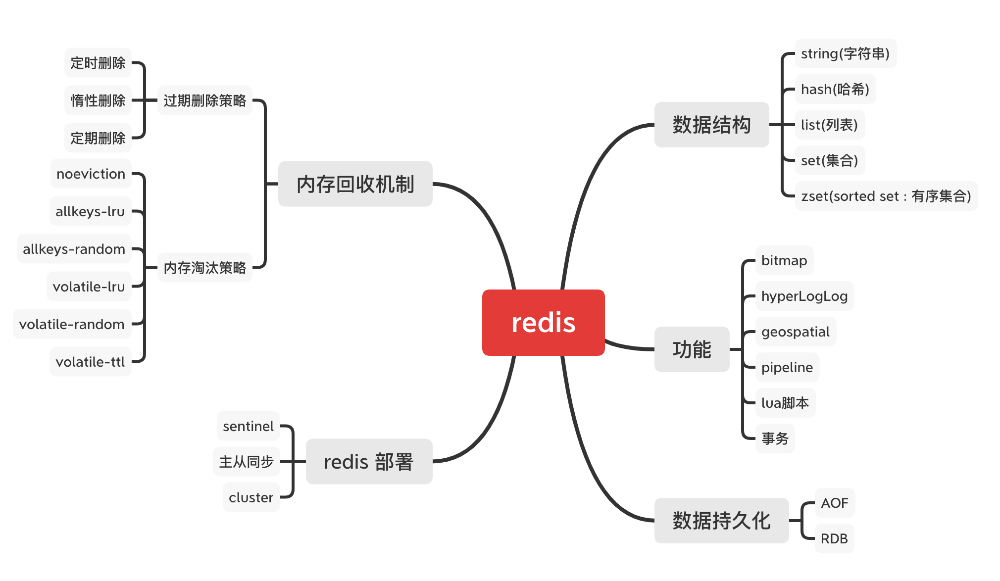
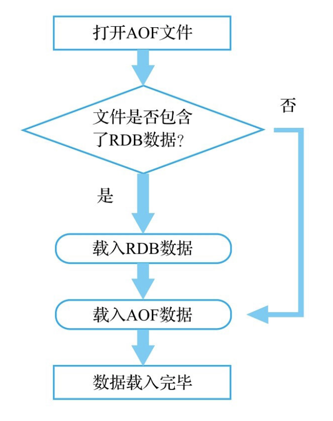
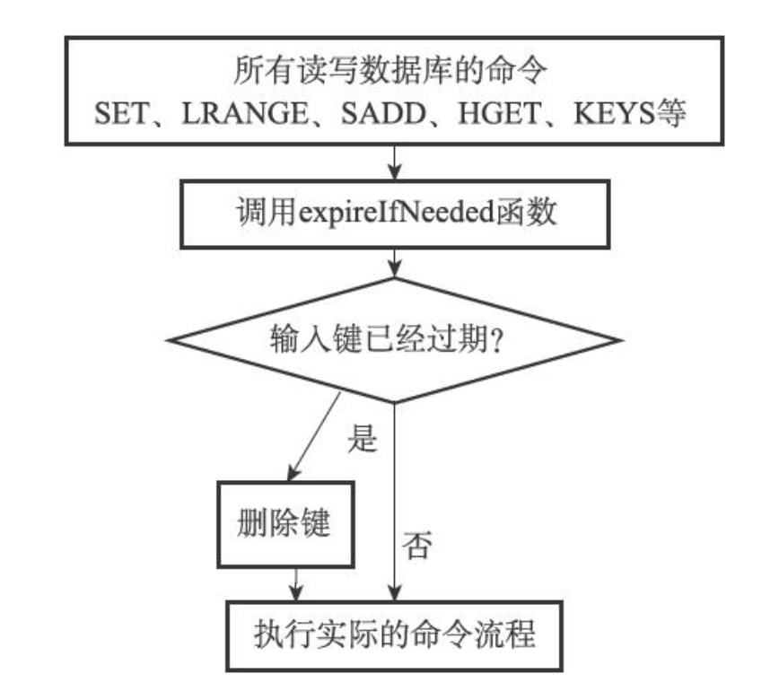
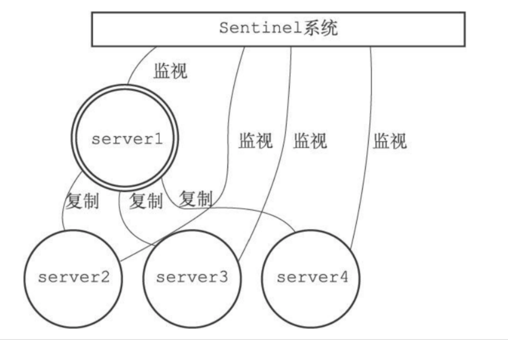
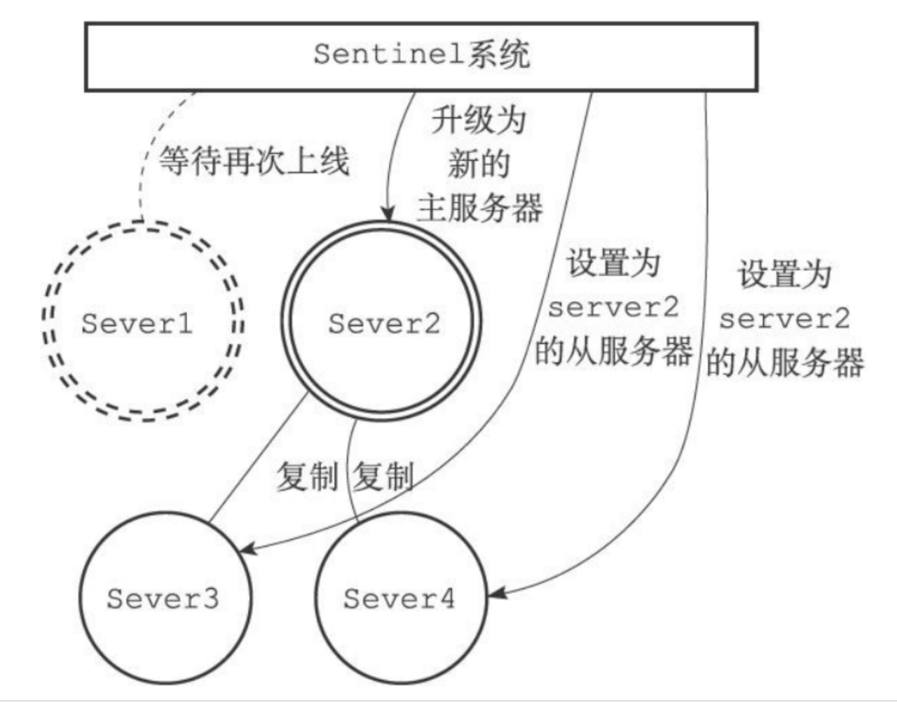
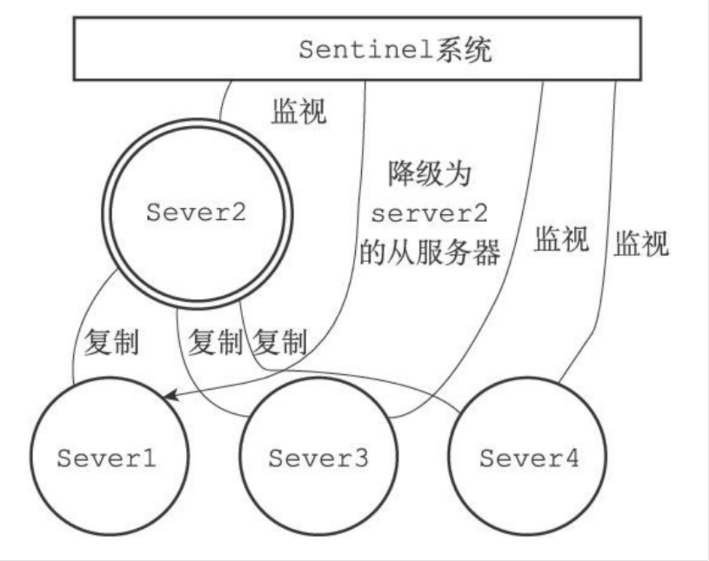
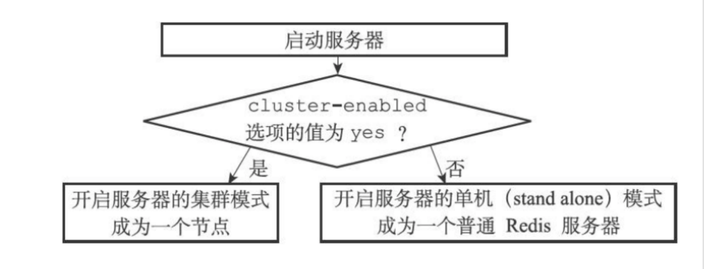
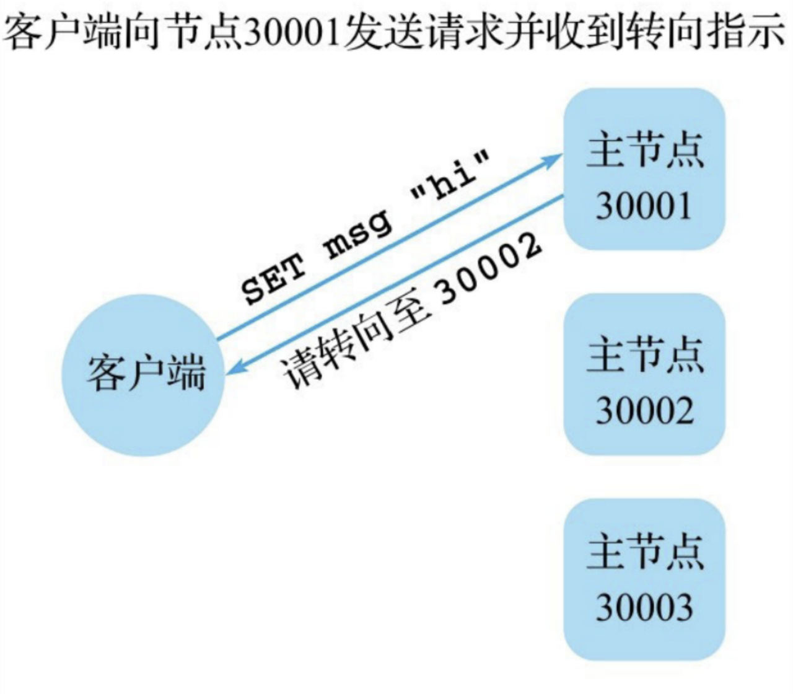
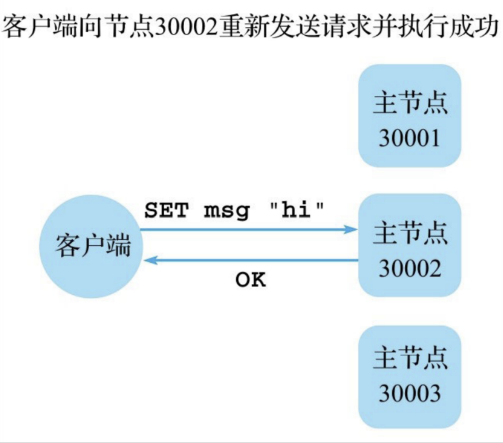

# Redis详解

**Redis (Remote Dictionary Server) 即远程字典服务.**

是一个开源的使用 ANSI C语言编写、支持网络、可基于内存亦可持久化的日志型、**key-value 数据库**，并提供多种语言的 API。是当下最热门的NoSQL 技术之一，也被人们称之为机构化数据库。

**redis高性能的设计体现**

据说: QPS: 100000+（每秒内查询次数）

1.完全基于内存，绝大部分请求是纯粹的内存操作，非常快速。它的，数据存在内存中，类似于HashMap，HashMap的优势就是查找和操作的时间复杂度都是O(1)；

2.数据结构简单，对数据操作也简单，Redis中的数据结构是专门进行设计的；

3.采用单线程，避免了不必要的上下文切换和竞争条件，也不存在多进程或者多线程导致的切换而消耗 CPU，不用去考虑各种锁的问题，不存在加锁释放锁操作，没有因为可能出现死锁而导致的性能消耗；

4.使用多路I/O复用模型，非阻塞IO；

5.使用底层模型不同，它们之间底层实现方式以及与客户端之间通信的应用协议不一样，Redis直接自己构建了VM 机制 ，因为一般的系统调用系统函数的话，会浪费一定的时间去移动和请求；



**数据类型**

String：字符串List（列表）: 用作栈、队列、阻塞队列。Hash(哈希)：也是 key - value 形式的，但是value 是一个map。Set（集合）ZSet(排序集合)HeperloglogBitmap（位图）Geo (地图坐标)Stream(流)

**持久化**

1.RDB：默认持久化机制，是对 Redis 中的数据执行周期性的持久化。2.AOF：AOF 机制对每条写入命令作为日志，以 append-only 的模式写入一个日志文件中，因为这个模式是只追加的方式，所以没有任何磁盘寻址的开销，所以很快。3.RDB-AOF混合持久化

**1.RDB (Save指令)**

1.创建新的RDB文件

2.遍历数据库包含的所有数据库，并将各个数据库包含的键值对全部记录到RDB文件中

3.代替已有的RDB文件


**2.RDB (BGSave)**1.创建子进程2.子进程执行SAVE命令，创建新的RDB文件.3.RDB文件创建完毕之后，子进程退出并通知Redis服务器进程（父进程）新RDB文件已经完成4.Redis服务器进程使用新RDB文件替换已有的RDB文件

**RDB相关配置**

```
save 900 1   #保存数据到硬盘 ，如果 900s 内，至少有 1 个 key 进行了修改，进行持久化操作
save 300 10
save 60 10000
stop-writes-on-bgsave-error yes  # 如果持久化出错，是否还要继续工作
rdbcompression yes    # 是否压缩 rdb 文件，需要消耗一些 cpu 资源
rdbchecksum yes # 保存 rdb 文件的时候，进行错误的检查校验
dir ./  # rdb 文件保存的目录
dbfilename dump.rdb # 存储rdb文件的文件名
```

**RDB触发机制**1.save 的规则满足的情况下，会自动触发 rdb 规则2.执行 flushall 命令，也会触发 rdb 规则3.退出 redis 也会产生 rdb 文件

**RDB优缺点**优点：1.适合大规模的数据恢复2.对数据的完整性要求不高缺点：1.需要一定的时间间隔进行操作，如果 Redis 意外宕机，最后一次修改的数据就没有了2.fork 进程的时候，会占用一定的空间。

**2.AOF (Append Only File)**AOF提供的是增量式的持久化功能,以日志形式来记录每个操作，将 Redis 执行的过程的所有指令记录下来（读操作不记录），只追加文件但不可以改写文件，redis 启动之初会读取该文件重新构建数据，换言之，redis 重启的话就根据日志文件的内容将写指令从前到后执行一遍以完成数据的恢复工作。**AOF相关配置**

```
appendonly yes   #默认是no
appendfilename “appendonly.aof”
#AOF文件的冲洗频率
appendsync everysec 每秒执行一次sync,可能会丢失这一秒的数据
#appendsync always  每次修改都会sync,消耗性能
#appendsync no   不执行fsync调度,这个时候操作系统自己同步数据，速度最快
auto-aof-rewrite-percentage  100
auto-aof-rewrite-min-size 64mb
BGREWRITEAOF  触发aof重写
```

**AOF优缺点**优点：通过使用everysec选项，用户可以将数据丢失的时间窗口限制在1s之内缺点：因为AOF文件存储的是协议文本，所以它的体积会比包含相同数据、二进制格式的RDB文件要大得多,修复速度也比rdb慢

**3.RDB-AOF混合持久化**

Redis4.0版本开始引入

配置aof-use-rdb-preamble yes开启

选项的值设置成了yes，那么Redis服务器在执行AOF重写操作时，就会像执行BGSAVE命令那样，根据数据库当前的状态生成出相应的RDB数据，并将这些数据写入新建的AOF文件中，至于那些在AOF重写开始之后执行的Redis命令，则会继续以协议文本的方式追加到新AOF文件的末尾，即已有的RDB数据的后面。



**内存回收机制**1.Key过期删除策略2.内存使用到达maxmemory上限时触发内存溢出控制策略

先说下**过期删除策略**1.**定时删除**:在设置键的过期时间的同时，创建一个定时器（timer），让定时器在键的过期时间来临时，立即执行对键的删除操作。2.**惰性删除**: 放任键过期不管，但是每次从键空间中获取键时，都检查取得的键是否过期，如果过期的话，就删除该键；如果没有过期，就返回该键。3.**定期删除**:每隔一段时间，程序就对数据库进行一次检查，删除里面的过期键。至于要删除多少过期键，以及要检查多少个数据库，则由算法决定。在这三种策略中，第一种和第三种为主动删除策略，而第二种则为被动删除策略。**redis采用了惰性删除和定期删除策略**[参考](http://stiles.cc/archives/92/在这三种策略中，第一种和第三种为主动删除策略，而第二种则为被动删除策略。 https://www.cnblogs.com/capacity-yang/p/13095005.html)

**惰性删除策略的实现**

过期键的惰性删除策略由db.c/expireIfNeeded函数实现，所有读写数据库的Redis命令在执行之前都会调用expireIfNeeded函数对输入键进行检查：

如果输入键已经过期，那么expireIfNeeded函数将输入键从数据库中删除。

如果输入键未过期，那么expireIfNeeded函数不做动作。



**定期删除**

Redis内部维护一个定时任务，默认每秒运行10次。定时任务中删除过期键逻辑采用了自适应算法，根据键的过期比例，使用快慢两种速率回收键，流程如下图


**流程说明**

1.定时任务在每个数据库空间随机检查20个键，当发现过期时删除对应的键

2.如果超过检查数的25%的键过期，循环执行回收逻辑直到不足25%或运行超时为止，慢模式下超时时间为25毫秒

3.如果之前回收键逻辑超时，则在Redis触发内部事件之前再次以快模式运行回收过期键任务，快模式下超时时间为1毫秒且2秒内只能运行1次

4.快慢两种模式内部删除逻辑相同，只是执行的超时时间不同。

**内存淘汰机制**

noeviction:返回错误当内存限制达到并且客户端尝试执行会让更多内存被使用的命令（大部分的写入指令，但DEL和几个例外）

allkeys-lru: 尝试回收最少使用的键（LRU），使得新添加的数据有空间存放。

volatile-lru: 尝试回收最少使用的键（LRU），但仅限于在过期集合的键,使得新添加的数据有空间存放。

allkeys-random: 回收随机的键使得新添加的数据有空间存放。

volatile-random: 回收随机的键使得新添加的数据有空间存放，但仅限于在过期集合的键。

volatile-random: 回收随机的键使得新添加的数据有空间存放，但仅限于在过期集合的键。

volatile-ttl: 回收在过期集合的键，并且优先回收存活时间（TTL）较短的键,使得新添加的数据有空间存放。

volatile为前缀的策略都是从已过期的数据集中进行淘汰。allkeys为前缀的策略都是面向所有key进行淘汰。LRU（least recently used）最近最少用到的。LFU（Least Frequently Used）最不常用的。它们的触发条件都是Redis使用的内存达到阈值时。

**Redis部署**1.主从复制2.Sentinel（哨岗、哨兵）是Redis的高可用性解决方案3.cluster

**1.主从复制(master-slave replication)**主从模式是三种模式中最简单的，在主从复制中，数据库分为两类：主数据库(master)和从数据库(slave)。以下指令设置服务器为主服务器到从服务器replicaof host portredis-server - -port 6380 - -replicaof 127.0.0.1 6379

当一个从数据库启动后，会向主数据库发送SYNC命令，主数据库接收到SYNC命令后会开始在后台保存快照（即RDB持久化的过程），并将保存期间接收到的命令缓存起来。当快照完成后，Redis会将快照文件和所有缓存的命令发送给从数据库。从数据库收到后，会载入快照文件并执行收到的缓存的命令。当主从数据库断开重连后会重新执行上述操作，不支持断点续传。

**主从复制到完整同步操作**主服务器执行BGSAVE命令，生成一个RDB文件，并使用缓冲区存储起在BGSAVE命令之后执行的所有写命令。当RDB文件创建完毕，主服务器会通过套接字将RDB文件传送给从服务器。从服务器在接收完主服务器传送过来的RDB文件之后，就会载入这个RDB文件，从而获得主服务器在执行BGSAVE命令时的所有数据。当从服务器完成RDB文件载入操作，并开始上线接受命令请求时，主服务器就会把之前存储在缓存区中的所有写命令发送给从服务器执行。

1. 每当主服务器执行完一个写命令之后，它就会将相同的写命令或者具有相同效果的写命令发送给从服务器执行。

2. 因为完整同步之后的主从服务器在执行最新出现的写命令之前，两者的数据库是完全相同的，而导致两者数据库出现不一致的正是最新被执行的写命令，因此从服务器只要接收并执行主服务器发来的写命令，就可以让自己的数据库重新与主服务器数据库保持一致。**部分同步操作**当一个Redis服务器成为另一个服务器的主服务器时，它会把每个被执行的写命令都记录到一个特定长度的先进先出队列中。当断线的从服务器尝试重新连接主服务器的时候，主服务器将检查从服务器断线期间，被执行的那些写命令是否仍然保存在队列里面。如果是，那么主服务器就会直接把从服务器缺失的那些写命令发送给从服务器执行，从服务器通过执行这些写命令就可以重新与主服务器保持一致，这样就避免了重新进行完整同步的麻烦。如果从服务器缺失的那些写命令已经不存在于队列当中，那么主从服务器将进行一次完整同步。**主从复制的优点:**在性能方面，Redis的复制功能可以给系统的读性能带来线性级别的提升.从理论上来说，用户每增加一倍数量的从服务器，整个系统的读性能就会提升一倍。其次，通过增加从服务器的数量，用户可以降低系统在遭遇灾难故障时丢失数据的可能性。最后，通过同时使用Redis的复制功能和Sentinel功能，用户可以为整个Redis系统提供高可用特性**2.Sentinel(哨兵)**启动哨兵命令: redis-sentinel /etc/sentinel.conf内容如下: sentinel monitor选项中的master-name参数用于指定主服务器的名字，这个名字在执行各种Sentinel操作的时候会经常用到；ip参数和port参数用于指定主服务器的IP地址和端口号；而quorum参数则用于指定判断这个主服务器下线所需的Sentinel数量。

   

例如:sentinel monitor test_db 127.0.0.1 16379 1

步骤

1.双环图形是当前的主服务器server1。

2.用单环图案表示的是主服务器的三个从服务器server2、server3以及server4。

3.server2、server3、server4三个从服务器正在复制主服务器server1，而Sentinel系统则在监视所有四个服务器



假设主服务器server1进入下线状态

下线时长超过用户设置时长上限,执行故障转移操作

1.Sentinel系统会挑选server1属下的其中一个从服务器，并将这个被选中的从服务器升级为新的主服务器。

2.Sentinel系统会向server1属下的所有从服务器发送新的复制指令，让它们成为新的主服务器的从服务器，当所有从服务器都开始复制新的主服务器时，故障转移操作执行完毕。

3.Sentinel还会继续监视已下线的server1，并在它重新上线时，将它设置为新的主服务器的从服务器。






Sentinel(哨兵)细节

1.由一个或多个Sentinel实例（instance）组成的Sentinel系统（system）可以监视任意多个主服务器，以及这些主服务器属下的所有从服务器，并在被监视的主服务器进入下线状态时，自动将下线主服务器属下的某个从服务器升级为新的主服务器，然后由新的主服务器代替已下线的主服务器继续处理命令请求。

2.普通服务器在初始化时会通过载入RDB文件或者AOF文件来还原数据库状态，但是因为Sentinel并不使用数据库，所以初始化Sentinel时就不会载入RDB文件或者AOF文件

3.使用 REDIS_SENTINEL_PORT 26379 为服务器端口

**3.Redis集群**

Redis提供的分布式数据库方案,集群通过分片（sharding）来进行数据共享，并提供复制和故障转移功能。

Redis-Cluster采用无中心结构，每个节点保存数据和整个集群状态,每个节点都和其他所有节点连接1.配置文件cluster-enable yes 开启集群节点

2.cluster meet ip port 添加入集群



集群的特点

1.所有的redis节点彼此互联(PING-PONG机制),内部使用二进制协议优化传输速度和带宽。

2.节点的fail是通过集群中超过半数的节点检测失效时才生效。

3.客户端与redis节点直连,不需要中间proxy层.客户端不需要连接集群所有节点,连接集群中任何一个可用即可。

**分片**1.与单机版Redis将整个数据库放在同一台服务器上的做法不同，Redis集群通过将数据库分散存储到多个节点上来平衡各个节点的负载压力。2.Redis集群会将整个数据库空间划分为16384个槽（slot）来实现数据分片（sharding），而集群中的各个主节点则会分别负责处理其中的一部分槽。当用户尝试将一个键存储到集群中时，客户端会先计算出键所属的槽，接着在记录集群节点槽分布的映射表中找出处理该槽的节点，最后再将键存储到相应的节点中**槽**Redis集群通过分片的方式来保存数据库中的键值对：集群的整个数据库被分为16384个槽（slot），数据库中的每个键都属于这16384个槽的其中一个，集群中的每个节点可以处理0个或最多16384个槽。


**主节点和从节点**

Redis集群中的节点分为主节点（master）和从节点（slave），其中主节点用于处理槽，而从节点则用于复制某个主节点，并在被复制的主节点下线时，代替下线主节点继续处理命令请求。

命令转向





**为何集群高性能**

Redis集群采用无代理模式，客户端发送的所有命令都会直接交由节点执行，并且对于经过优化的集群客户端来说，客户端发送的命令在绝大部分情况下都不需要实施转向，或者仅需要一次转向，因此在Redis集群中执行命令的性能与在单机Redis服务器上执行命令的性能非常接近。除了节点之间互通信息带来的性能损耗之外，单个Redis集群节点处理命令请求的性能与单个Redis服务器处理命令请求的性能几乎别无二致。从理论上来讲，集群每增加一倍数量的主节点，集群对于命令请求的处理性能就会提高一倍。

- 以上内容采集于网络由个人汇总整理,如有侵权请告知后及时删除.转载：请注明出处http://stiles.cc/archives/92/

**参考资料**

https://blog.itzhouq.cn/redis1[redis设计与实践](https://e.jd.com/30189715.html)