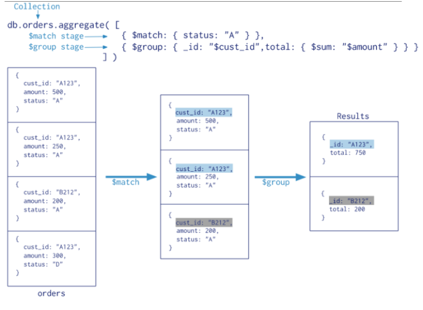
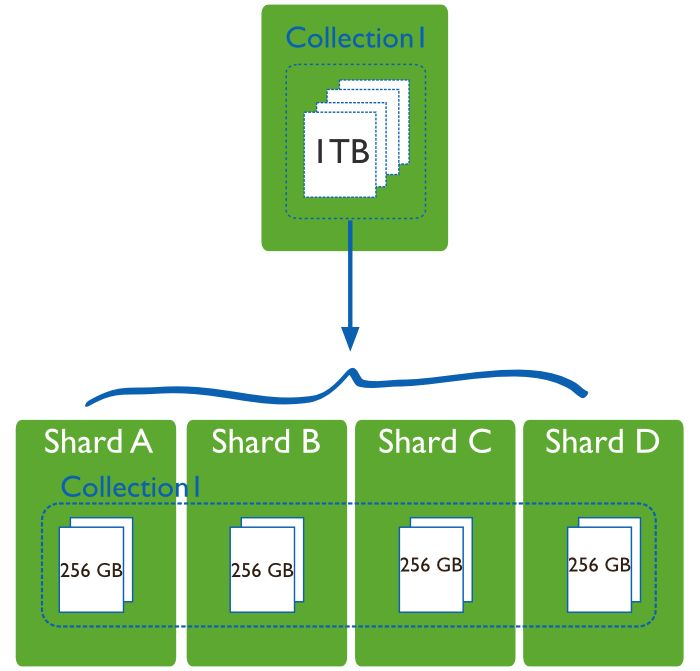

# mongodb-入门到使用

**1.什么是mongodb**

MongoDB是一个高性能、开源、无模式的文档型数据库，使用C++开发，是当前NoSQL数据库产品中最热门的一种。在许多场景下，它可以替代传统的关系型数据库或键-值存储方式.

Mongodb从3.0开始默认使用的是WiredTiger引擎数据库排名：DB-Engines：https://db-engines.com/en/ranking


**文档形数据库特点**

1:满足了海量数据的存储和访问需求

2:字段要求不严格，可以随意地增加、删除、修改字段，且不需要预先定义表结构*按照官方文档记载，当数据量达到50GB以上时，MongoDB的数据库访问速度是MySQL的10倍以上。

MongoDB快的原因是:

1: MongoDB的设计要求你常用的数据（working set)可以在内存里装下。这样大部分操作只需要读内存，自然很快。

2: 文档性模式设计一般会是你所需要的数据都相对集中在一起（内存或硬盘），大家知道硬盘读写耗时最多是随机读写所产生的磁头定位时间，数据集中在一起则减少了关系性数据库需要从各个地方去把数据找过来（然后Join）所耗费的随机读时间

3: 可以平行扩展。目前一般的百万次并发量都是通过几十上百个节点的集群同时实现。这一点MySQL基本无法做到（或者要花很大定制的代价）

写操作MongoDB比传统数据库快的根本原因是Mongo使用的内存映射技术写入数据时候只要在内存里完成就可以返回给应用程序，这样并发量自然就很高。而保存到硬体的操作则在后台异步完成。

**适用场景**

1.对数据库高并发读写的需求

2.对海量数据的高效率存储和访问的需求

3.对数据库的高可扩展性和高可用性的需求

**和传统数据库简单对比**

非结构型数据库。没有行和列的概念，用Json(Bson)来存储数据

**Nosql(Not Only SQL)兴起**

由于关系型数据库的范式约束、事务特性、磁盘 IO 等特点，若服务器使用关系型数据库，当有大量数据产生时，传统的关系型数据库已经无法满足快速查询与插入数据的需求。NoSQL 的出现解决了这一危机。它通过降低数据的安全性，减少对事务的支持，减少对复杂查询的支持，获取性能上的提升

| Nosql                                   | RDBMS                        |
| --------------------------------------- | ---------------------------- |
| 没有声明式查询语句                      | 高度组织化结构化数据         |
| 没有预定义的模式                        | 结构化查询语言（SQL）        |
| 健-值对存储，列存储，文档存储，图形存储 | 数据和关系都存储在单独的表中 |
| 最终一致性，而非ACID属性                | 数据操作语言，数据定义语言   |
| 非结构化和不可预知的数据                | 严格的一致性                 |
| CAP定理                                 | 基础事务                     |
| 高性能，高可用性和可伸缩性              |                              |

MongoDB的文档相当于关系数据库中的一条记录。多个文档组成一个集合，相当于关系数据库的表。多个集合逻辑上组织在一起就是数据库。一个MongoDB实例支持多个数据库。


| 关系型数据库                                                 | Mongodb                                                      |
| ------------------------------------------------------------ | ------------------------------------------------------------ |
| 数据库（database）                                           | 数据库（database）                                           |
| 表（table）                                                  | 集合（collection）                                           |
| 行（row）                                                    | document or BSON document（文档）                            |
| column（列）                                                 | field（字段）                                                |
| index（索引）                                                | index（索引）                                                |
| table joins（表连接）                                        | embedded documents and linking（嵌入的文档和链接）           |
| primary key Specify any unique column or column combination as primary key.（指定任意唯一的列或列组合作为主键） | primary keyIn MongoDB, the primary key isautomatically set to the _id field.（在 MongoDB 中，主键被自动设置为 _id 字段） |
| aggregation (e.g. group by)                                  | MongoDB provides three ways to perform aggregation: the aggregation pipeline, the map-reduce function, and single purpose aggregation methods.（聚合操作） |

文档是MongoDB中数据的基本单元，非常类似于关系型数据库管理系统中的行，但更具表现力。集合（collection）可以看作是一个拥有动态模式（dynamic schema）的表。数据库（database），每一个数据库都拥有自己的集合。

**mongodb基本数据类型**

| 数据类型           | Mongodb                                                      |
| ------------------ | ------------------------------------------------------------ |
| String             | 字符串。存储数据常用的数据类型。在 MongoDB 中，UTF-8 编码的字符串才是合法的。 |
| Integer            | 整型数值。用于存储数值。根据你所采用的服务器，可分为 32 位或 64 位。 |
| Boolean            | 布尔值。用于存储布尔值（真/假）。                            |
| Double             | 将一个值与 BSON（二进制的 JSON）元素的最低值和最高值相对比。 |
| Min/Max keys       | 布尔值。用于存储布尔值（真/假）。                            |
| Arrays             | 用于将数组或列表或多个值存储为一个键。                       |
| Timestamp          | 时间戳。记录文档修改或添加的具体时间。                       |
| Object             | 用于内嵌文档。                                               |
| Null               | 用于创建空值。                                               |
| Symbol             | 符号。该数据类型基本上等同于字符串类型，但不同的是，它一般用于采用特殊符号类型的语言。 |
| Date               | 日期时间。用 UNIX 时间格式来存储当前日期或时间。你可以指定自己的日期时间：创建 Date 对象，传入年月日信息。 |
| Object ID          | 对象 ID。用于创建文档的 ID。                                 |
| Binary Data        | 二进制数据。用于存储二进制数据。                             |
| Code               | 代码类型。用于在文档中存储 JavaScript 代码。                 |
| Regular expression | 正则表达式类型。用于存储正则表达式。                         |

- 每一个文档都有一个特殊的键"_id"，这个键在文档所属的集合中是唯一的。数据库最终会变成文件系统里的文件,而数据库名就是相应的文件名

**2: 基本命令（CRUD）插入操作**

```
db.collection.insertOne()
db.collection.insertMany()
```


**读取操作**

db.collection.find()

你可以指定查询过滤器或条件来标识要返回的文档


**更新操作**

```
db.collection.updateOne()
db.collection.updateMany()
db.collection.replaceOne()
```

你可以指定查询过滤器或条件来标识要更新的文档，这里的 过滤器和读操作的语法是一致的。


**删除操作**

```
db.collection.deleteOne()
db.collection.deleteMany()
```

你可以指定查询过滤器或条件来标识要删除的文档，这里的过滤器和读操作的语法是一致的。


其它命令（MongoDB中文手册|官方文档中文版）：

https://docs.mongoing.com/

聚合管道(Aggregation Pipeline)

用来对集合中的文档进行变换和组合。



**管道操作符**

| 管道操作符 | Description                                |
| ---------- | ------------------------------------------ |
| $project   | 增加,删除,重命名字段                       |
| $match     | 条件匹配。只满足条件的文档才能进入下一阶段 |
| $limit     | 限制结果的数量                             |
| $skip      | 跳过文档的数量                             |
| $sort      | 条件排序                                   |
| $group     | 条件组合结果                               |
| $lookup    | $lookup操作符 用以引入其他集合的数据       |

**SQL和Mongodb对比**

| WHERE    | $match   |
| -------- | -------- |
| GROUP BY | $group   |
| HAVING   | $match   |
| SELECT   | $project |
| ORDER BY | $sort    |
| LIMIT    | $limit   |
| SUM()    | $sum     |
| COUNT()  | $count   |
| JOIN     | $lookup  |

**3: 索引**

索引就相当于字典的目录，先从目录上找到对应查询内容的具体位置，不需要翻遍整本书，就可以直接跳转到目标文档的位置，提高查询的速度。

- MongoDB索引默认创建的是B树索引为啥mongodb是B树，而mysql选择B+树：https://zhuanlan.zhihu.com/p/102628897

**单字段索引**

这里的keyname表示键名；-1:表示索引值按降序排列；1 :表示索引值按升序排列；创建单列唯一索引使用以下语法：

```
db.collection.createIndex( { keyname : -1 } )
db.collection.createIndex( {keyname : -1},{"unique" : true})
```

**复合索引**

复合索引是Single Field Index的升级版本，它针对多个字段联合创建索引，先按第一个字段排序，第一个字段相同的文档按第二个字段排序，依次类推，如下针对age, name这2个字段创建一个复合索引。

```
db.collection.createIndex( { <field1>:<type>,<field2>:<type> , ......} )
db.user.createIndex( { name : -1 , age : -1 } )
```

例如，集合test，记录如下：

**多key索引**

为了索引包含数组值的字段，MongoDB为数组中的每个元素创建一个索引键。

```
{
    "_id" : ObjectId("5f9a617e09e11b41c8ef0943"),
    "name" : "小张",
    "age" : 10.0,
    "description" : "知识分享5",
    "skill" : [
        "java",
        "c#",
        "python"
    ]
}
db.person.createIndex( {skill: 1} )  // 自动创建多key索引
db.person.find( {skill: "java"} )
```

文本(全文)索引MongoDB提供全文索引支持文本搜索查询字符串内容。全文索引可以是其值为字符串或字符串元素的数组的字段。目前，MongoDB集合最多只支持一个全文索引。

```
db.collection.createIndex( { <fields>:"text" } )
db.collection.createIndex( { <fields1>:"text",<fields2>:"text",......} )
```

MongoDB的索引几乎与传统的关系型数据库一模一样索引实际就是对指定字段进行排序的数据结构基于B-Tree的结构提升查询速度。（时间复杂度logn）复合键索引可以对多个字段进行排序。复合键索引只能支持前缀子查询

**4.MongoDB的事务、ACID和一致性事务**

事务是指由一系列数据库操作组成的一个完整的逻辑过程，这个过程中的所有操作要么都成功，要么都不成功。比如：常见的例子就是银行转账的例子，一次转账操作会包含多个数据库操作，而这些数据库操作需要放到一个事务当中，保证其要么都成功，要么都不成功。

**ACID**

ACID是事务的四个特性，指的是atomicity，原子性；consistency，一致性；isolation，隔离性；durability，持久性。

1. 原子性(atomicity): 指所有在事务中的操作要么都成功，要么都不成功，所有的操作都不可分割，没有中间状态。一旦某一步执行失败，就会全部回滚到初始状态。
2. 一致性(consistency): 指的是逻辑上的一致性，即所有操作是符合现实当中的期望的。具体参考下一节
3. 隔离性(isolation): 即不同事务之间的相互影响和隔离的程度。比如，不同的隔离级别，事务的并发程度也不同，最强的隔离状态是所有的事务都是串行化的（serializable）（即一个事务完成之后才能进行下一个事务），这样并发性也会降到最低，在保证了强一致性的情况下，性能也会受很大影响，所以在实际工程当中，往往会折中一下。
4. 持久性(durability): 可以简单地理解为事务执行完毕后数据不可逆并持久化存储于存储系统当中

**理解一致性**

实际上我们通常说的数据库事务的一致性和分布式系统的一致性并不是一个概念。这里可以区分成“内部一致性”和“外部一致性”。“内部一致性”搞数据库的人很少这么说，一般就直接说一致性，更准确的说是“Consistency in ACID”（“事务 ACID 属性中的一致性”）；“外部一致性”是针对分布式系统而言的，分布式领域提及的 Consistency 表示系统的正确性模型，著名的 CAP 理论中的 C 就是这个范畴的。这主要是由于分布式系统写入和读取都可能不在同一台机器上，而这必然会有一段时间导致不同机器上所存的数据不一致的情况，这就是所谓的“不一致时间窗口”。

**CAP**

CAP理论主要是针对分布式存储系统的，

Consistency一致性:是指对于每一次读操作，要么都能够读到最新写入的数据，要么错误。

Availability可用性:是指对于每一次请求，都能够得到一个及时的、非错的响应，但是不保证请求的结果是基于最新写入的数据。

Partition tolerance分区容忍性:是指由于节点之间的网络问题，即使一些消息对包或者延迟，整个系统能继续提供服务（提供一致性或者可用性）。

CAP定理认为分布式系统中这三个特性最多只能同时满足两个特性。下面我们来分别看下这三个特性究竟是什么意思。http://www.ruanyifeng.com/blog/2018/07/cap.html

**mongodb架构模式**

Replica set：复制集，mongodb的架构方式之一 ，通常是三个对等的节点构成一个“复制集”集群，有“primary”和secondary等多中角色，其中primary负责读写请求，secondary可以负责读请求，这有配置决定，其中secondary紧跟primary并应用write操作；如果primay失效，则集群进行“多数派”选举，选举出新的primary，即failover机制，即HA架构。复制集解决了单点故障问题，也是mongodb垂直扩展的最小部署单位，当然sharding cluster中每个shard节点也可以使用Replica set提高数据可用性。


Sharding cluster：分片集群，数据水平扩展的手段之一；replica set这种架构的缺点就是“集群数据容量”受限于单个节点的磁盘大小，如果数据量不断增加，对它进行扩容将时非常苦难的事情，所以我们需要采用Sharding模式来解决这个问题。将整个collection的数据将根据sharding key被sharding到多个mongod节点上，即每个节点持有collection的一部分数据，这个集群持有全部数据，原则上sharding可以支撑数TB的数据。



**5.客户端工具安装Studio 3T**

下载地址：

https://robomongo.org/

怎么使用：

https://mp.weixin.qq.com/s/gk1Bbydz4EY_1x4PpEbIXA

- 以上内容采集于网络由个人汇总整理,如有侵权请告知后及时删除.转载：请注明出处 http://stiles.cc/archives/127/

**参考资料**

https://docs.mongoing.com/https://cloud.tencent.com/developer/article/1710629