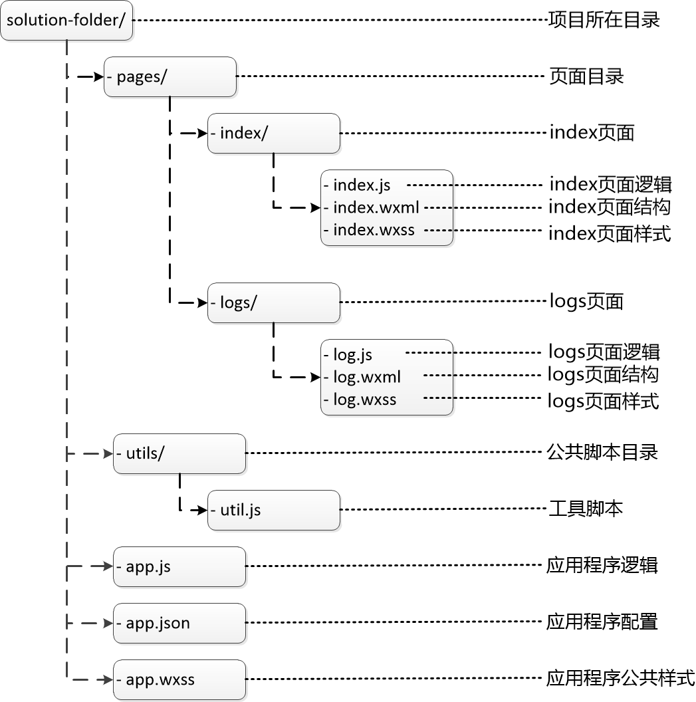

# 小程序开发介绍

**1.小程序诞生的背景**

1.1：微信小程序，简称小程序，英文名Mini Program。是一种不需要下载安装即可使用的应用，它实现了应用“触手可及”的梦想，用户扫一扫或搜一下即可打开应用。

1.2：2017年1月9日，张小龙在2017微信公开课Pro上发布的小程序正式上线。

1.3：微信要打造一个以微信为中心的生态链，不以绑定用户为目标。比如生活中有一些不太常用的app，我们可能一年也使用不了几次，但是有时候就需要用到，微信就想要提供这样一个平台，让你可以在微信中使用这中所谓的app的功能。或者说可以这样理解，让微信成为一个类似于Windows的操作系统，各种小程序就是操作系统上的应用软件。

**2.开发者工具和文档**开发文档：[点击这里](https://developers.weixin.qq.com/miniprogram/dev/framework/)。申请账号：[点击这里](https://mp.weixin.qq.com/wxopen/waregister?action=step1)，根据指引填写信息和提交相应的资料，就可以拥有自己的小程序帐号。

Windows 64位：[点我下载](https://servicewechat.com/wxa-dev-logic/download_redirect?type=x64&from=mpwiki&t=1474644089434)

Windows 32位：[点我下载](https://servicewechat.com/wxa-dev-logic/download_redirect?type=ia32&from=mpwiki&t=1474644089434)

Mac 版 ：[点我下载](https://servicewechat.com/wxa-dev-logic/download_redirect?type=darwin&from=mpwiki&t=1474644089434)

**3.开发介绍**

从事过网页编程的人知道，网页编程采用的是 HTML + CSS + JS 这样的组合，其中 HTML 是用来描述当前这个页面的结构，CSS 用来描述页面的样子，JS 通常是用来处理这个页面和用户的交互。

同样道理，在小程序中也有同样的角色，其中 WXML 充当的就是类似 HTML 的角色，WXSS 充当的就是类似 CSS 的角色,具有 CSS 大部分的特性.样式支持详情点击这里

小程序自有一套基础组件，包括view,scroll-view,icon,progress,image,video,map等

在小程序开发中大部分使用Flex布局：

Flex 布局教程：[语法篇](http://www.ruanyifeng.com/blog/2015/07/flex-grammar.html)Flex 布局教程：[实例篇](http://www.ruanyifeng.com/blog/2015/07/flex-examples.html)

小程序默认项目结构

app.wxss 的样式默认全局使用,可以配置一些通用样式。 
在 page 的 wxss 文件中定义的样式为局部样式，只作用在对应的页面，并会覆盖 app.wxss 中相同的选择器。
app.json 是对整个小程序的全局配置。我们可以在这个文件中配置小程序是由哪些页面组成，配置小程序的窗口背景色，配置导航条样式，配置默认标题。
pages目录下的js中的方法，onLoad、onShow、onReady、onHide、onUnload 是页面的生命周期函数，分别在页面加载、显示、初次渲染完成、隐藏和卸载时调用。其中onLoad和onReady只会在页面加载时调用一次，onShow则每次显示页面都会调用一次。

**4.总结**

本篇简单介绍了下小程序，和记录了下基本的几个知识点，后续在介绍下详细的开发案例。

**5.参考资料**

[微信小程序开发初探](https://www.cnblogs.com/edisonchou/p/6081851.html)