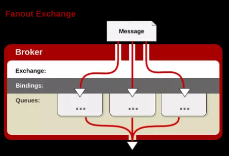
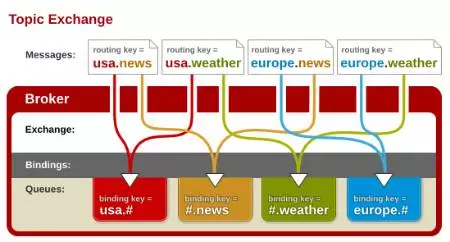

**1.RabbitMQ介绍**

RabbitMQ：是采用Erlang实现的给予AMQP协议标准的消息队列，建立在Erlang OTP平台上。

安装顺序如下：

1：http://www.erlang.org/downloads，下载Erlang OTP安装包。

2：http://www.rabbitmq.com/install-windows.html，下载rabbitmq安装包。

**2. AMQP messaging 中的基本概念**

**Broker**: 接收和分发消息的应用，RabbitMQ Server就是Message Broker。**Virtual host**: 出于多租户和安全因素设计的，把AMQP的基本组件划分到一个虚拟的分组中，类似于网络中的namespace概念。当多个不同的用户使用同一个RabbitMQ server提供的服务时，可以划分出多个vhost，每个用户在自己的vhost创建exchange／queue等。**Connection**: publisher／consumer和broker之间的TCP连接。断开连接的操作只会在client端进行，Broker不会断开连接，除非出现网络故障或broker服务出现问题。**Channel**: 如果每一次访问RabbitMQ都建立一个Connection，在消息量大的时候建立TCP Connection的开销将是巨大的，效率也较低。Channel是在connection内部建立的逻辑连接，如果应用程序支持多线程，通常每个thread创建单独的channel进行通讯，AMQP method包含了channel id帮助客户端和message broker识别channel，所以channel之间是完全隔离的。Channel作为轻量级的Connection极大减少了操作系统建立TCP connection的开销。**Exchange**: message到达broker的第一站，根据分发规则，匹配查询表中的routing key，分发消息到queue中去。常用的类型有：direct (point-to-point), topic (publish-subscribe) and fanout (multicast)。**Queue**: 消息最终被送到这里等待consumer取走。一个message可以被同时拷贝到多个queue中。**Binding**: exchange和queue之间的虚拟连接，binding中可以包含routing key。Binding信息被保存到exchange中的查询表中，用于message的分发依据。**3.Exchange类型**

Exchange有多种类型，最常用的是Direct／Fanout／Topic三种类型。

**Direct**

Message中的“routing key”如果和Binding中的“binding key”一致， Direct exchange则将message发到对应的queue中。

**Fanout**

每个发到Fanout类型Exchange的message都会分到所有绑定的queue上去。

**Topic**

根据routing key，及通配规则，Topic exchange将分发到目标queue中。Routing key中可以包含两种通配符，类似于正则表达式：“#”通配任何零个或多个word“*”通配任何单个word

**4.常用命令**

启动web管理工具:安装目录的sbin 目录下 rabbitmq-plugins.bat enable rabbitmq_management

暂停服务：net stop RabbitMQ

开启服务：net start RabbitMQ

查看已有用户：rabbitmqctl.bat list_users

新增一个用户：rabbitmqctl.bat add_user username password

设置用户为超级管理员 ：rabbitmqctl.bat set_user_tags username administrator

修改密码：rabbitmqctl change_password userName newPassword

删除用户：rabbitmqctl.bat delete_user username

权限设置

按照官方文档，用户权限指的是用户对exchange，queue的操作权限，包括配置权限，读写权限。我们配置权限会影响到exchange、queue的声明和删除。

我们配置权限会影响到exchange、queue的声明和删除。

读写权限影响到从queue里取消息、向exchange发送消息以及queue和exchange的绑定(binding)操作。

例如： 将queue绑定到某exchange上，需要具有queue的可写权限，以及exchange的可读权限；向exchange发送消息需要具有exchange的可写权限；从queue里取数据需要具有queue的可读权限

权限相关命令为：

(1) 设置用户权限

rabbitmqctl set_permissions -p VHostPath User ConfP WriteP ReadP

(2) 查看(指定hostpath)所有用户的权限信息

rabbitmqctl list_permissions [-p VHostPath]

(3) 查看指定用户的权限信息

rabbitmqctl list_user_permissions User

(4) 清除用户的权限信息

rabbitmqctl clear_permissions [-p VHostPath] User

(1) 超级管理员(administrator)

可登陆管理控制台(启用management plugin的情况下)，可查看所有的信息，并且可以对用户，策略(policy)进行操作。

(2) 监控者(monitoring)

可登陆管理控制台(启用management plugin的情况下)，同时可以查看rabbitmq节点的相关信息(进程数，内存使用情况，磁盘使用情况等)

(3) 策略制定者(policymaker)

可登陆管理控制台(启用management plugin的情况下), 同时可以对policy进行管理。

(4) 普通管理者(management)

仅可登陆管理控制台(启用management plugin的情况下)，无法看到节点信息，也无法对策略进行管理。

(5) 其他的

无法登陆管理控制台，通常就是普通的生产者和消费者。

5.主要端口说明

- 4369 (epmd), 25672 (Erlang distribution)
- 5672, 5671 (AMQP 0-9-1 without and with TLS)
- 15672 (if management plugin is enabled)
- 61613, 61614 (if STOMP is enabled)
- 1883, 8883 (if MQTT is enabled)

**4369 (epmd), 25672 (Erlang distribution)**Epmd 是 Erlang Port Mapper Daemon 的缩写，在 Erlang 集群中相当于 dns 的作用，绑定在4369端口上。

**5672, 5671 (AMQP 0-9-1 without and with TLS)**AMQP 是 Advanced Message Queuing Protocol 的缩写，一个提供统一消息服务的应用层标准高级消息队列协议，是应用层协议的一个开放标准，专为面向消息的中间件设计。基于此协议的客户端与消息中间件之间可以传递消息，并不受客户端/中间件不同产品、不同的开发语言等条件的限制。Erlang 中的实现有 RabbitMQ 等。

**15672 (if management plugin is enabled)**通过 http://serverip:15672 访问 RabbitMQ 的 Web 管理界面，默认用户名密码都是 guest。（注意：RabbitMQ 3.0之前的版本默认端口是55672，下同）

**61613, 61614 (if STOMP is enabled)**Stomp 是一个简单的消息文本协议，它的设计核心理念就是简单与可用性，官方文档，实践一下 Stomp 协议需要：

一个支持 stomp 消息协议的 messaging server (譬如activemq，rabbitmq）；一个终端（譬如linux shell);一些基本命令与操作（譬如nc，telnet)

**1883, 8883 (if MQTT is enabled)**MQTT 只是 IBM 推出的一个消息协议，基于 TCP/IP 的。两个 App 端发送和接收消息需要中间人，这个中间人就是消息服务器（比如ActiveMQ/RabbitMQ），三者通信协议就是 MQTT

6.参考文档：

https://www.cnblogs.com/frankyou/p/5283539.html

https://www.cnblogs.com/diegodu/p/4971586.html

https://www.cnblogs.com/liuxingke/articles/9889517.html